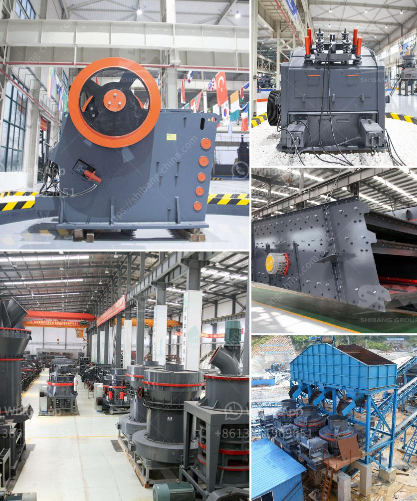

<h3>rock crushing limpopo</h3>
Nestled in the heart of South Africa, the majestic province of Limpopo holds enormous potential for economic growth. One industry that is rapidly gaining momentum in this region is rock crushing. With its mining-rich landscape, the province is blessed with abundant rock formations that can be transformed into valuable resources, contributing to the development of the region and the country as a whole.

Rock crushing involves the mechanical process of breaking down large rocks into smaller, more manageable pieces. The resulting crushed rocks can then be used in various applications, from construction materials like road aggregates and concrete to landscaping products and even in the production of industrial minerals.

One of the key factors propelling the growth of rock crushing in Limpopo is the increasing demand for construction materials. As urban areas continue to expand and infrastructure projects thrive, the need for quality aggregates and other rock products becomes more pronounced. Rock crushing operations can produce a wide range of aggregates with varying sizes and specifications, making them versatile and suitable for various construction projects.

Another advantage of rock crushing in Limpopo is the potential for job creation and local economic growth. Rock crushing operations require a wide array of skilled workers, ranging from machine operators to technicians. By investing in training and development programs, the industry not only boosts the local economy but also provides employment opportunities for the residents of Limpopo.

Furthermore, rock crushing helps to reduce the environmental impact of mining operations. Instead of extracting rocks from new quarries, which often require large-scale excavation and destruction of natural habitats, rock crushing can utilize existing rock formations, minimizing the need for additional mining activities and preserving the region's biodiversity.

To ensure responsible and sustainable rock crushing practices, it is crucial to adhere to strict environmental regulations and employ modern technologies that minimize air and noise pollution. Additionally, the industry should prioritize land rehabilitation to restore the extracted areas back to their natural state once the rock crushing operations are concluded.

As rock crushing continues to gain momentum in Limpopo, the government and industry stakeholders should work hand in hand to support its growth and optimize its potential. This includes providing favorable policies and incentives that encourage investment in the sector, promoting research and development to improve efficiency and reduce environmental impacts, and developing partnerships to foster innovation and knowledge sharing.

In conclusion, rock crushing in Limpopo represents a significant opportunity for economic growth and sustainable development. With the province's abundant rock formations and increasing demand for construction materials, the industry has the potential to transform rocks into valuable resources, create jobs, and minimize environmental impact. However, it is essential to ensure responsible and sustainable practices are followed to harness the full potential of this industry and safeguard the natural beauty of Limpopo for future generations.
<h3>Contact us</h3><ul><li><strong>Whatsapp:&nbsp;<a href="https://wa.me/8613661969651">+8613661969651</a></strong></li><li><a href="https://swt.shibang-china.com/?git&amp;zhl&amp;rock crushing limpopo"><strong>Online Service(chat now)</strong></a></li></ul><h3>Related</h3><ul><li><a href='crushers and grinders mill.md'>crushers and grinders mill</a></li><li><a href='how much is a ball mill.md'>how much is a ball mill</a></li><li><a href='sand in washing machine.md'>sand in washing machine</a></li><li><a href='calcium carbonate crushers.md'>calcium carbonate crushers</a></li><li><a href='stone crusher price in australia.md'>stone crusher price in australia</a></li></ul>