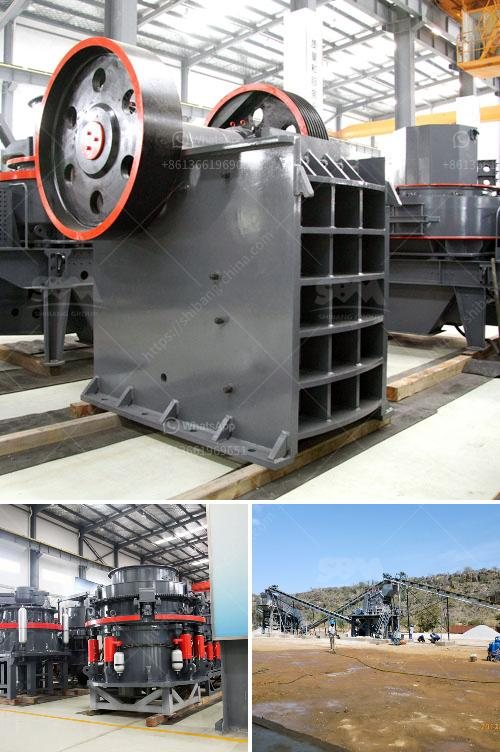

<h3>rock crushing machine for sale</h3>
Rock crushing machines are widely used in mining, construction, and quarrying industries. They can effectively break down rocks into different sizes for various purposes. These machines are essential equipment in any rock crushing plant. If you are in need of a rock crushing machine for your next project, there are certain factors you need to consider.

Firstly, you need to determine the type of rock you will be working with. Different rocks require different machines. For example, softer rocks like limestone and sandstone can be easily crushed with a jaw crusher. On the other hand, harder rocks like granite and basalt may require a cone crusher or impact crusher for efficient crushing.

Secondly, you need to assess the desired output size. Rock crushing machines come in different sizes, and each machine has different maximum feeding size. It is crucial to choose a machine that can handle the size of rocks you will be processing. You should also check the machine's capacity to ensure it can crush the desired volume of rocks within a given timeframe.

Another factor to consider is the machine's power and efficiency. High-powered machines can crush rocks faster and more efficiently. They also consume less energy, which can result in cost savings in the long run. You should also check if the machine has advanced features like automatic control systems and hydraulic adjustment for easy operation and maintenance.

Finally, cost is a crucial aspect to consider. Rock crushing machines come in different price ranges, and you need to find one that suits your budget without compromising quality and performance. You can compare prices from different suppliers and consider purchasing used machines if they are well-maintained and offer considerable savings.

In conclusion, purchasing a rock crushing machine for sale requires careful consideration of the rock type, output size, power and efficiency, and cost. By taking these factors into account, you can find the right machine that meets your specific needs and ensures smooth and efficient rock crushing operations.
<h3>Contact us</h3><ul><li><strong>Whatsapp:&nbsp;<a href="https://wa.me/8613661969651">+8613661969651</a></strong></li><li><a href="https://swt.shibang-china.com/?git&amp;zhl&amp;rock crushing machine for sale"><strong>Online Service(chat now)</strong></a></li></ul><h3>Related</h3><ul><li><a href='copper slag recycling plants china.md'>copper slag recycling plants china</a></li><li><a href='limestone production equipment.md'>limestone production equipment</a></li><li><a href='gold plant for sale in africa.md'>gold plant for sale in africa</a></li><li><a href='mobile crushing alocation.md'>mobile crushing alocation</a></li><li><a href='price for vsi crusher.md'>price for vsi crusher</a></li></ul>