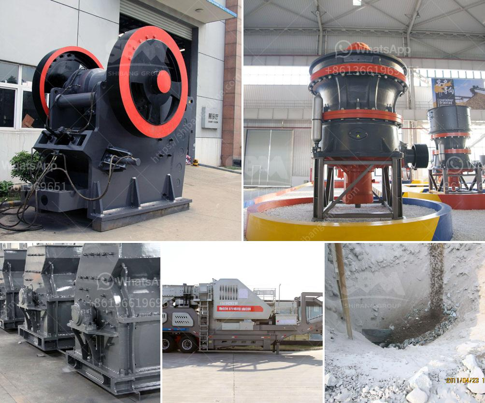

<h3>roler mill 10 ton per hoursprice</h3>
The roller mill is a vital piece of equipment in the agricultural and industrial sectors. This machine is used to grind various materials into a fine powder, making it ideal for processing grains, livestock feed, and minerals. With its high capacity and efficiency, the roller mill has become an essential tool in many operations.

One specific aspect to consider when purchasing a roller mill is its capacity. A 10-ton per hour capacity is a common requirement for most applications. This means that the mill can process 10 tons of material per hour, allowing for ample output to meet the demands of various industries.

When looking for a roller mill with a 10-ton per hour capacity, several factors come into play, and one of the most important considerations is price. There is a range of roller mills available on the market, each with its unique features and pricing. The price of a roller mill could be influenced by several factors such as brand reputation, build quality, and additional features.

Brand reputation plays a crucial role in determining the price of a roller mill. Established brands that have been in the industry for a long time and have a proven track record often charge a higher price due to their reliability and quality. By opting for a trusted brand, customers can be assured of a durable and efficient machine that will last for years.

The build quality of a roller mill also affects its price. Mills made with high-quality materials and robust construction techniques tend to have a higher price tag. However, opting for a well-built machine can save money in the long run, as it will require fewer repairs and have a longer service life compared to a cheaper alternative.

Additional features are another consideration that can influence the price of a roller mill. Some mills may come with advanced features such as automated control systems, digital displays, or adjustable settings. These additional features can enhance the machine's performance and ease of use, but they may come at an extra cost.

It is important to note that the price of a roller mill is not the sole factor to consider when making a purchase decision. Customers should also assess the machine's performance, maintenance requirements, and after-sales service provided by the manufacturer. Some manufacturers may offer warranties, customer support, and spare parts availability, which can add value to the overall package.

In conclusion, a roller mill with a 10-ton per hour capacity is a valuable investment for businesses in the agricultural and industrial sectors. When considering a purchase, customers should weigh factors such as brand reputation, build quality, additional features, and after-sales service alongside the price. By taking these factors into account, customers can make an informed decision and choose a roller mill that meets their needs both in terms of capacity and price.
<h3>Contact us</h3><ul><li><strong>Whatsapp:&nbsp;<a href="https://wa.me/8613661969651">+8613661969651</a></strong></li><li><a href="https://swt.shibang-china.com/?git&amp;zhl&amp;roler mill 10 ton per hoursprice"><strong>Online Service(chat now)</strong></a></li></ul><h3>Related</h3><ul><li><a href='vertical horizontal milling machine.md'>vertical horizontal milling machine</a></li><li><a href='quarry crusher for sales in germany.md'>quarry crusher for sales in germany</a></li><li><a href='quarry crushing line.md'>quarry crushing line</a></li><li><a href='raymond mill price list.md'>raymond mill price list</a></li><li><a href='marble crushing plants.md'>marble crushing plants</a></li></ul>