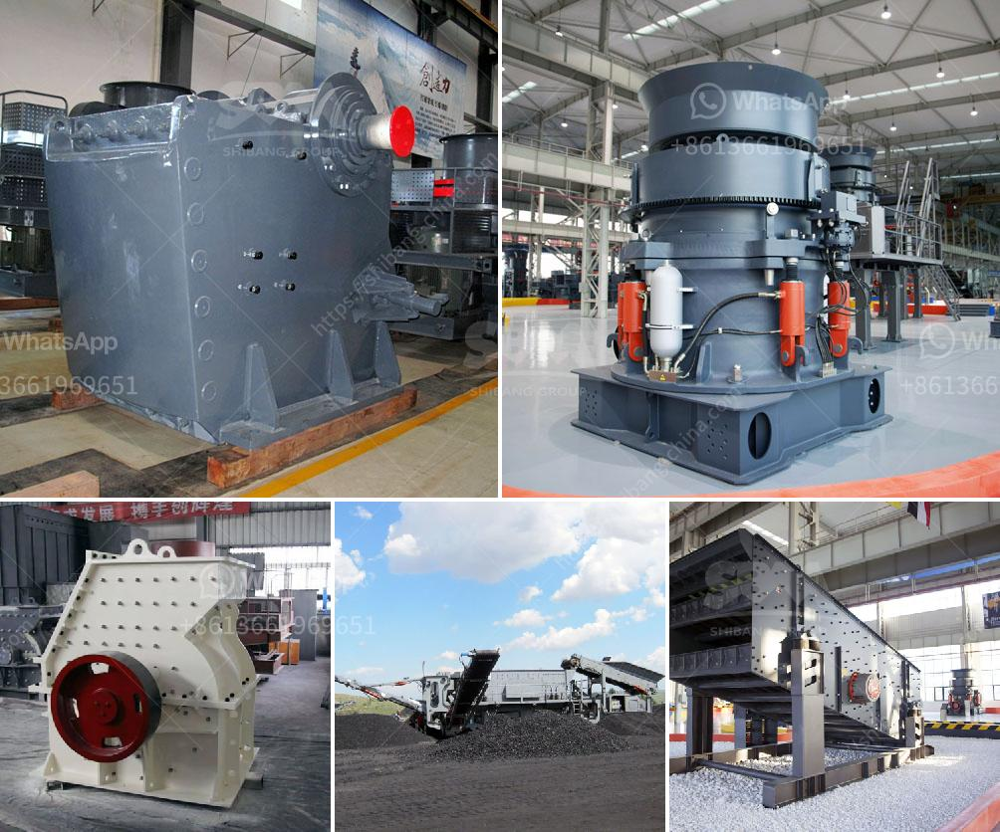

<h3>roll grinders mill manufacturers</h3>
Roll grinders are an essential piece of equipment for many industries that require precise and efficient grinding of various materials. These machines are used in mills, where large quantities of materials need to be processed, such as steel mills, paper mills, and rubber mills. In order to meet the demands of these industries, it is important to source roll grinders from reliable and reputable manufacturers.

One such manufacturer is XYZ Mill Technologies, a leading provider of roll grinders for the industry. With years of experience and expertise, XYZ Mill Technologies has become a trusted name in the market. Their roll grinders are designed to deliver exceptional performance, high precision, and reliable operation.

One of the key features of XYZ Mill Technologies' roll grinders is their ability to handle a wide range of materials. Whether it is steel, paper, rubber, or other materials, their machines can provide precise and consistent grinding results. This versatility makes them a preferred choice among mill owners.

Additionally, XYZ Mill Technologies' roll grinders are known for their durability and low maintenance requirements. These machines are built to withstand heavy usage and offer a long lifespan, resulting in reduced downtime and increased productivity. Moreover, their roll grinders are designed with user-friendly interfaces, making operation and maintenance hassle-free.

Furthermore, XYZ Mill Technologies' roll grinders are equipped with advanced automation and control systems. This allows for precise adjustment of grinding parameters, resulting in consistent and high-quality output. The automation also helps in reducing operator error and ensures optimum efficiency.

In conclusion, when it comes to roll grinders for mill applications, XYZ Mill Technologies stands out as a reliable and efficient choice. Their machines offer exceptional performance, precision, durability, and ease of use. With their vast experience and commitment to customer satisfaction, XYZ Mill Technologies is undoubtedly a top choice for mill owners and operators.
<h3>Contact us</h3><ul><li><strong>Whatsapp:&nbsp;<a href="https://wa.me/8613661969651">+8613661969651</a></strong></li><li><a href="https://swt.shibang-china.com/?git&amp;zhl&amp;roll grinders mill manufacturers"><strong>Online Service(chat now)</strong></a></li></ul><h3>Related</h3><ul><li><a href='crawler type mobile crusher.md'>crawler type mobile crusher</a></li><li><a href='rock crusher quarry.md'>rock crusher quarry</a></li><li><a href='horizontal impact crusher for sale.md'>horizontal impact crusher for sale</a></li><li><a href='small jaw crusher for sale.md'>small jaw crusher for sale</a></li><li><a href='3 roller raymond mill delhi.md'>3 roller raymond mill delhi</a></li></ul>