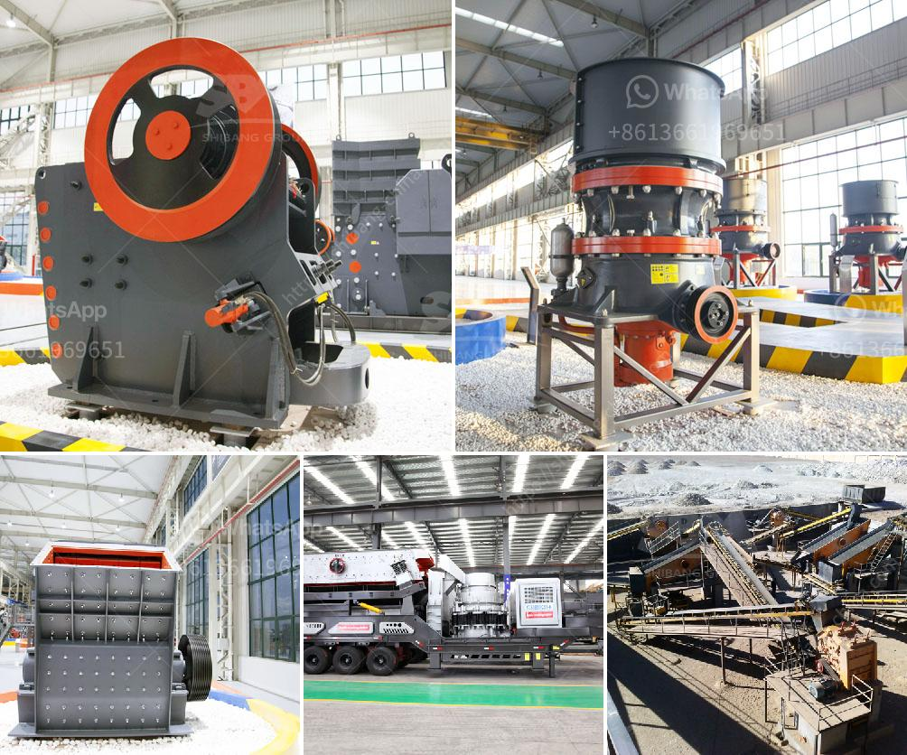

<h3>roll mill machine manufacturers</h3>
Roll mill machines are used in various industries for the production of smooth and uniform rolled sheets, strips, and foils. These machines are critical to the manufacturing process as they offer precise and consistent thickness and shape control, ensuring high-quality products. In order to meet the growing demand for roll mill machines, a wide range of manufacturers has emerged in the market.

One of the key factors to consider when choosing a roll mill machine manufacturer is their expertise and experience in the industry. Established manufacturers with a long history in the business often possess extensive knowledge and technical know-how, resulting in superior quality machines. They continuously invest in research and development to enhance their product offerings and stay ahead of the competition.

Furthermore, reputable roll mill machine manufacturers prioritize customer satisfaction by providing tailored solutions to meet specific requirements. They employ a team of skilled engineers and technicians who work closely with clients to understand their needs and design customized machines that maximize productivity and efficiency on the shop floor.

Another vital consideration when selecting a roll mill machine manufacturer is the availability of after-sales support and maintenance services. High-quality machines may occasionally require maintenance or repairs, and it is crucial to choose a manufacturer that offers prompt response times and reliable technical support. This ensures minimal downtime and allows businesses to quickly resume their operations.

Additionally, reputable manufacturers use high-quality materials and adhere to strict quality control standards, resulting in durable and reliable machines. They are committed to delivering products that meet international standards and regulations, ensuring long-lasting performance and customer satisfaction.

In conclusion, when searching for roll mill machine manufacturers, it is essential to consider their expertise, experience, customer support, and commitment to quality. By choosing a reputable manufacturer, businesses can be confident in the reliability and efficiency of their roll mill machines, ultimately boosting their productivity and profitability.
<h3>Contact us</h3><ul><li><strong>Whatsapp:&nbsp;<a href="https://wa.me/8613661969651">+8613661969651</a></strong></li><li><a href="https://swt.shibang-china.com/?git&amp;zhl&amp;roll mill machine manufacturers"><strong>Online Service(chat now)</strong></a></li></ul><h3>Related</h3><ul><li><a href='price of stone crusher in nigerian curency.md'>price of stone crusher in nigerian curency</a></li><li><a href='stone cracker machines.md'>stone cracker machines</a></li><li><a href='copper ore concentrate processing plant.md'>copper ore concentrate processing plant</a></li><li><a href='stone crusher plant sweden.md'>stone crusher plant sweden</a></li><li><a href='advantage and disadvantage of jaw crusher.md'>advantage and disadvantage of jaw crusher</a></li></ul>