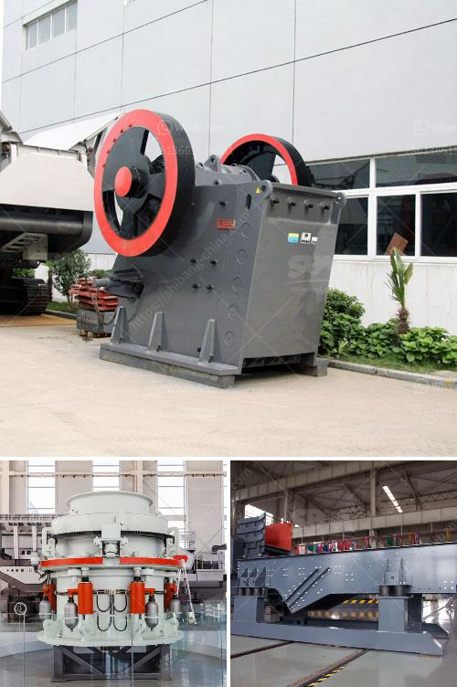

<h3>roller crusher manufacturer</h3>
In the vast arena of industrial machinery, roller crushers are among the most iconic pieces of equipment. Revered for their ability to transform bulky materials into a manageable form, these machines have become an integral part of numerous industries. One cannot overlook the importance of a reliable and efficient roller crusher manufacturer when it comes to obtaining high-quality equipment for various industrial applications.

A roller crusher, also known as a granulator or toothed roll crusher, efficiently reduces the size of materials such as coal, minerals, and ore while providing a consistent end product. With its innovative design and robust construction, this machine has gained immense popularity among industry professionals.

A reputable roller crusher manufacturer goes beyond merely producing Crushers; they aim to deliver unparalleled customer satisfaction. These companies invest significant resources in research and development to constantly improve the functionality and performance of their products. As a result, users can expect enhanced productivity, reduced energy consumption, and minimal maintenance requirements.

Additionally, roller crusher manufacturers focus on incorporating advanced control systems into their products. These systems enable operators to easily monitor and adjust various parameters, ensuring optimal performance at all times. This level of automation and precision empowers industries to streamline their operations and maximize output.

Moreover, environmental considerations are at the forefront for many roller crusher manufacturers. Their commitment to sustainable manufacturing practices includes utilizing eco-friendly materials and implementing energy-efficient processes. By embracing sustainability, these companies not only reduce their carbon footprint but also contribute to a greener future for industries worldwide.

To sum up, a roller crusher manufacturer plays a crucial role in meeting the diverse demands of industrial sectors. These manufacturers are committed to developing innovative solutions to drive industry growth while prioritizing customer satisfaction. As the demand for roller crushers continues to rise, such manufacturers will remain at the forefront, providing cutting-edge technology and comprehensive support to their customers.
<h3>Contact us</h3><ul><li><strong>Whatsapp:&nbsp;<a href="https://wa.me/8613661969651">+8613661969651</a></strong></li><li><a href="https://swt.shibang-china.com/?git&amp;zhl&amp;roller crusher manufacturer"><strong>Online Service(chat now)</strong></a></li></ul><h3>Related</h3><ul><li><a href='coal wash and crusher machine.md'>coal wash and crusher machine</a></li><li><a href='ball mill cement grinding.md'>ball mill cement grinding</a></li><li><a href='gold plant for sale south africa.md'>gold plant for sale south africa</a></li><li><a href='conveyor belts enginners in south africa.md'>conveyor belts enginners in south africa</a></li><li><a href='price quotation for rotary kiln machine.md'>price quotation for rotary kiln machine</a></li></ul>