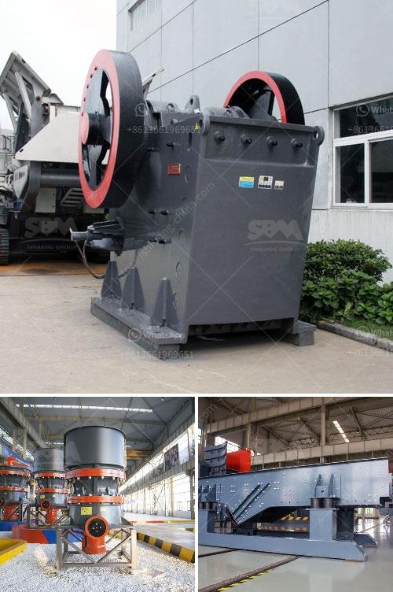

<h3>roller mill for powders</h3>
A roller mill for powders is a powerful and efficient grinding solution that has gained popularity in various industries. It is a versatile machine that can grind a wide range of materials into fine powders, making it ideal for applications such as pharmaceuticals, chemical processing, and food production.

The roller mill operates by utilizing multiple rollers that rotate in opposite directions, exerting pressure and friction on the material being ground. This action effectively breaks down the particles, resulting in a consistent and finely grinded powder. The adjustable gap between the rollers allows for precise control over the particle size, ensuring that the desired fineness is achieved.

One of the key advantages of a roller mill is its ability to handle different types of materials. From fragile to abrasive substances, the machine can efficiently grind them all. This versatility makes it a preferred choice in industries where a variety of powders are required. Whether it is dry or wet grinding, a roller mill can effectively process both, ensuring excellent results.

Another significant benefit of a roller mill is its high efficiency. With its strong grinding capabilities, the machine can reduce the particle size and increase the surface area of the powders, leading to quicker and more effective blending, mixing, and dissolving processes. This feature is particularly essential for industries that rely on finely grinded powders for their production processes.

Apart from its grinding prowess, a roller mill is also known for its robust construction and low maintenance requirements. The high-strength materials used in its design ensure durability and longevity, minimizing the need for frequent repairs or replacements. Furthermore, the machine's straightforward design facilitates easy cleaning and maintenance, making it a cost-effective solution for powder processing.

In conclusion, a roller mill for powders offers an efficient and versatile grinding solution for various industries. Its ability to handle different materials, control particle size, and enhance powder properties makes it a valuable asset in pharmaceuticals, chemical processing, and food production. With its high efficiency and low maintenance requirements, a roller mill is an excellent investment for businesses looking to optimize their powder processing operations.
<h3>Contact us</h3><ul><li><strong>Whatsapp:&nbsp;<a href="https://wa.me/8613661969651">+8613661969651</a></strong></li><li><a href="https://swt.shibang-china.com/?git&amp;zhl&amp;roller mill for powders"><strong>Online Service(chat now)</strong></a></li></ul><h3>Related</h3><ul><li><a href='lokomo jaw crusher.md'>lokomo jaw crusher</a></li><li><a href='cement making process.md'>cement making process</a></li><li><a href='quarry crusher zimbabwe.md'>quarry crusher zimbabwe</a></li><li><a href='stone crushing plant cost in pakistan.md'>stone crushing plant cost in pakistan</a></li><li><a href='cement manufacturing plant.md'>cement manufacturing plant</a></li></ul>