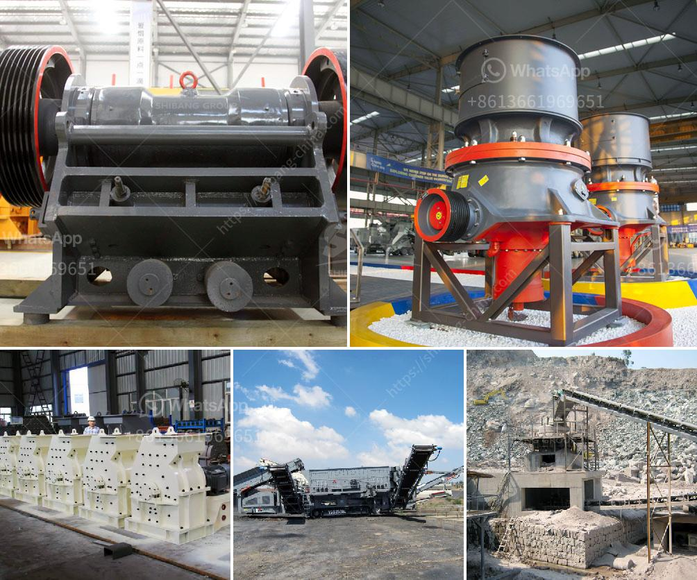

<h3>roller mill from china</h3>
Roller mills have been an integral part of the milling industry since the 19th century. Their ability to process a wide range of materials and their durability makes them essential equipment for industries across the globe. China, as a key player in the manufacturing sector, has been at the forefront of producing high-quality roller mills that are in high demand worldwide.

A roller mill is a type of grinding mill that consists of two or more parallel cylindrical rollers that rotate in opposite directions. The material to be milled is fed into the gap between the rollers, where it is crushed and ground. These mills are widely used in various industries such as flour milling, cement production, mining, and chemical processing.

China has a long history of roller mill production, and over the years, the country has developed advanced technology and expertise in manufacturing these machines. Chinese roller mills are known for their robust construction, precision engineering, and efficient operation. They are designed to withstand heavy duty and continuous use, ensuring a high level of reliability and performance.

One notable feature of roller mills from China is their versatility. They can handle various materials, including grains, minerals, chemicals, and even the hardest and most abrasive substances. This versatility makes them suitable for a wide range of applications and industries. For example, roller mills are used in the flour milling industry to produce finely ground flours from wheat and other grains. In the cement industry, they are used to grind raw materials and clinker to create cement. In mining, they are used to grind ores and produce powders for further processing.

In addition to their versatility, roller mills from China also offer high energy efficiency, which is a crucial consideration for many industries looking to optimize their operational costs. The rollers in these mills are precision-engineered to minimize energy losses and maximize the grinding efficiency. This results in lower power consumption and reduced operating costs, making Chinese roller mills an attractive choice for businesses across various sectors.

China's roller mill manufacturers also prioritize product safety and environmental sustainability. These mills are built with safety features to ensure the protection of workers and prevent accidents. Additionally, they are designed to minimize environmental impact by incorporating advanced dust control systems and adhering to strict emission regulations.

With their exceptional quality, innovative design, and competitive pricing, roller mills from China have gained a strong reputation in the global market. They are exported to numerous countries and used in a wide range of industries, contributing to the development of local economies and meeting the ever-growing demand for high-quality milling equipment.

In conclusion, roller mills from China are sought after for their robust construction, versatility, and energy efficiency. Chinese manufacturers have made significant advancements in the design and production of these machines, ensuring their exceptional quality and reliability. As the demand for milling equipment continues to rise, roller mills from China are poised to play a prominent role in the global market.
<h3>Contact us</h3><ul><li><strong>Whatsapp:&nbsp;<a href="https://wa.me/8613661969651">+8613661969651</a></strong></li><li><a href="https://swt.shibang-china.com/?git&amp;zhl&amp;roller mill from china"><strong>Online Service(chat now)</strong></a></li></ul><h3>Related</h3><ul><li><a href='part of roller mill.md'>part of roller mill</a></li><li><a href='gravel belt conveyor rental toronto.md'>gravel belt conveyor rental toronto</a></li><li><a href='used rock crusher dealers in usa.md'>used rock crusher dealers in usa</a></li><li><a href='cement manufacturing process pdf.md'>cement manufacturing process pdf</a></li><li><a href='price of artificial sand mill.md'>price of artificial sand mill</a></li></ul>