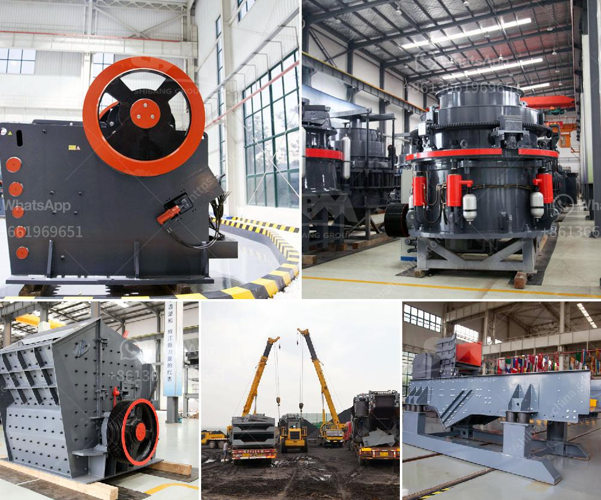

<h3>roller mill machine</h3>
The roller mill machine is a key part of the milling process. Its main purpose is to grind grains and turn them into flour that can be used for various culinary applications. This versatile piece of equipment has been around for centuries and continues to be an essential tool in the milling industry.

The roller mill machine consists of two large metal rollers that rotate in opposite directions. As grains are fed into the machine, they are crushed and ground between the rollers. The distance between the rollers can be adjusted, allowing for different types of grains and desired fineness of the flour.

One of the major advantages of using a roller mill machine is its ability to produce consistent and uniform flour. The even grinding action of the rollers ensures that every particle of grain is ground to the same size, resulting in a high-quality flour. This is especially important in commercial settings where consistency is key.

Furthermore, the roller mill machine is known for its efficiency. It can process a large volume of grains in a relatively short amount of time. This is due to the roller design, which provides a large grinding surface area. As a result, the machine can grind more grains with less effort and energy consumption.

The roller mill machine is also suitable for a wide range of grains and other materials. From wheat and corn to barley and oats, this versatile machine can handle it all. It can even grind non-grain materials such as nuts, seeds, and spices. This makes it a valuable tool not only in flour mills but also in other industries such as pharmaceuticals, food processing, and animal feed production.

Another advantage of using a roller mill machine is its low maintenance requirements. The design of the machine allows for easy access to the internal components, making cleaning and maintenance tasks quick and hassle-free. This not only saves time but also reduces the risk of contamination and prolongs the lifespan of the machine.

Furthermore, the roller mill machine is a cost-effective solution for milling operations. Its relatively low initial cost and minimal operating expenses make it an attractive option for both small-scale and large-scale milling facilities. Additionally, its high grinding efficiency helps minimize wastage, resulting in savings in raw material costs.

In conclusion, the roller mill machine is a versatile and efficient tool for grinding grains and other materials. Its ability to produce consistent and high-quality flour makes it an essential piece of equipment in the milling industry. With its low maintenance requirements and cost-effectiveness, it is a valuable investment for any milling operation. So whether you are a small flour mill or a large-scale industrial facility, consider adding a roller mill machine to your milling process for optimal results.
<h3>Contact us</h3><ul><li><strong>Whatsapp:&nbsp;<a href="https://wa.me/8613661969651">+8613661969651</a></strong></li><li><a href="https://swt.shibang-china.com/?git&amp;zhl&amp;roller mill machine"><strong>Online Service(chat now)</strong></a></li></ul><h3>Related</h3><ul><li><a href='small scale mining rock crushers for sale.md'>small scale mining rock crushers for sale</a></li><li><a href='iron ore crusher in mexico.md'>iron ore crusher in mexico</a></li><li><a href='coal crusher machine pdf.md'>coal crusher machine pdf</a></li><li><a href='gold ore mining equipment companies in germany.md'>gold ore mining equipment companies in germany</a></li><li><a href='processing of limestone and crushing.md'>processing of limestone and crushing</a></li></ul>