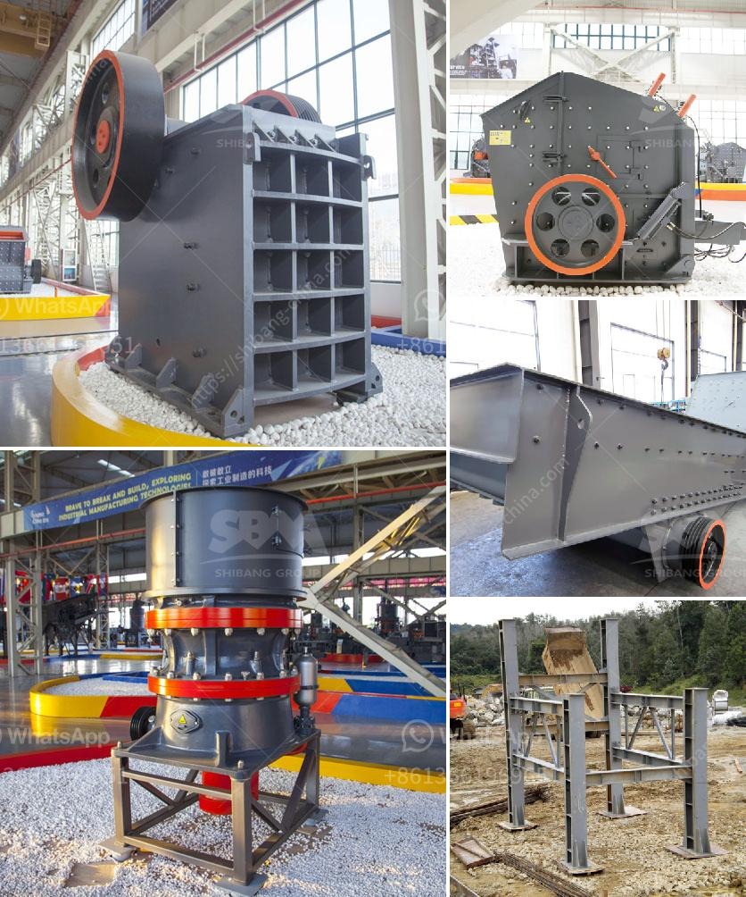

<h3>roller mill manufacturers</h3>
The roller mill manufacturing industry has been growing rapidly, as manufacturers strive to meet the increasing demand for efficient and sustainable grinding solutions. Roller mills are used to crush and grind various materials, such as wheat, corn, and rice. The technology behind roller mills has evolved over the years, resulting in advanced grinding machinery that delivers exceptional performance and reliability.

One of the leading players in the roller mill manufacturing industry is XYZ Company. With over 50 years of experience, XYZ Company has established itself as a reputable and trusted manufacturer of roller mills. Their commitment to innovation, research, and development has enabled them to stay ahead of the competition and meet the ever-changing needs of their customers.

XYZ Company prides itself on the quality of its roller mills. Their machinery is precision engineered to deliver consistent and precise grinding results. The roller mills manufactured by XYZ Company are known for their durability, long service life, and low maintenance requirements. This ensures that customers can rely on their roller mills to operate smoothly and efficiently, minimizing downtime and maximizing productivity.

In addition to quality, XYZ Company also focuses on sustainability in their manufacturing processes. They understand the importance of reducing energy consumption and minimizing environmental impact. As a result, they have implemented various measures to ensure their roller mills are energy efficient and environmentally friendly. These measures include implementing advanced automation systems, utilizing energy-efficient motors, and optimizing the design of their machinery to minimize waste.

Another notable player in the roller mill manufacturing industry is ABC Corporation. ABC Corporation has been in the business for over 40 years and has gained a strong reputation for their high-quality roller mills. Their machinery is known for its precise control over particle size distribution, which is crucial in achieving desired grinding outcomes. The roller mills manufactured by ABC Corporation are widely used in the food processing, pharmaceutical, and chemical industries.

ABC Corporation also recognizes the importance of sustainability in their manufacturing processes. They have implemented measures to reduce their carbon footprint, such as using renewable energy sources and implementing recycling programs. They are constantly exploring new technologies and methodologies to further improve the energy efficiency and environmental sustainability of their roller mills.

The roller mill manufacturing industry is highly competitive, with manufacturers vying to provide the best solutions to their customers. This competition drives innovation and ensures that customers have access to the latest advancements in grinding technology. Manufacturers are investing heavily in research and development to improve their products, enhance efficiency, and minimize environmental impact.

In conclusion, roller mill manufacturers play a vital role in providing efficient and sustainable grinding solutions. Companies like XYZ Company and ABC Corporation are leading the way in this industry, constantly striving to deliver high-quality roller mills that meet the needs of their customers. With a focus on quality, efficiency, and sustainability, roller mill manufacturers are driving the industry forward and revolutionizing the way materials are ground and processed.
<h3>Contact us</h3><ul><li><strong>Whatsapp:&nbsp;<a href="https://wa.me/8613661969651">+8613661969651</a></strong></li><li><a href="https://swt.shibang-china.com/?git&amp;zhl&amp;roller mill manufacturers"><strong>Online Service(chat now)</strong></a></li></ul><h3>Related</h3><ul><li><a href='granite crusher cost.md'>granite crusher cost</a></li><li><a href='business plan for marble and granite factory pdf.md'>business plan for marble and granite factory pdf</a></li><li><a href='grinding a stone crusher.md'>grinding a stone crusher</a></li><li><a href='crushing plant for sale in tanzania.md'>crushing plant for sale in tanzania</a></li><li><a href='proposal usaha stone crusher.md'>proposal usaha stone crusher</a></li></ul>