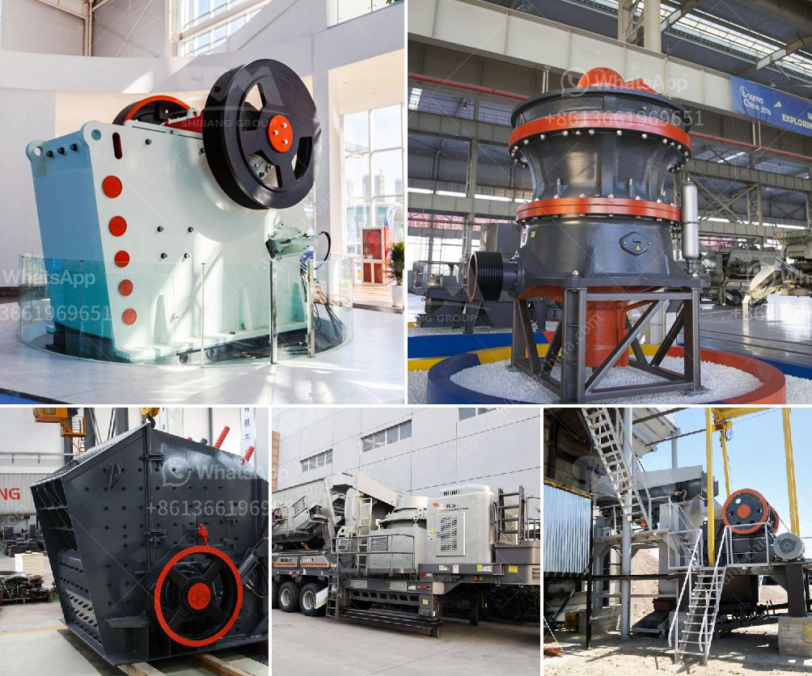

<h3>roller mill pictures</h3>
When it comes to milling grains, a roller mill is an essential piece of equipment. Efficient and reliable, roller mills are used in the food processing industry to crush or grind various materials into smaller particles. To better understand this mechanical process, it is helpful to explore roller mill pictures that showcase the inner workings of these powerful machines.

One of the most striking features of a roller mill is its size. These machines are typically large, with a robust metal frame and multiple rollers positioned horizontally or vertically. Roller mills can feature two, three, four, or more rollers, depending on the specific application and desired outcome.

The rollers themselves are essential components of the milling process. Made from durable materials like steel or cast iron, the rollers are designed with ridges or grooves that help to crush or grind the material being processed. These ridges or grooves create a powerful shearing action, which breaks down the particles into smaller sizes.

Roller mills can be operated manually or automated, depending on the scale of the operation and available resources. Modern roller mills often come equipped with advanced control systems, which allow operators to finely adjust various parameters such as roller speed and gap size. This level of control ensures consistent performance and optimal milling results.

When looking at roller mill pictures, it becomes evident that these machines are built to withstand heavy-duty use. They are designed to handle large quantities of materials and withstand high pressures and speeds. Additionally, roller mills can be customized to accommodate different types of grains and other materials, making them versatile and adaptable to various applications.

In conclusion, roller mill pictures reveal the impressive machinery involved in grain milling. These machines play a critical role in the food processing industry, providing efficient and effective milling solutions. With their robust construction, advanced controls, and versatile nature, roller mills are an essential tool for achieving high-quality, consistent results in food production.
<h3>Contact us</h3><ul><li><strong>Whatsapp:&nbsp;<a href="https://wa.me/8613661969651">+8613661969651</a></strong></li><li><a href="https://swt.shibang-china.com/?git&amp;zhl&amp;roller mill pictures"><strong>Online Service(chat now)</strong></a></li></ul><h3>Related</h3><ul><li><a href='stone cracker machines.md'>stone cracker machines</a></li><li><a href='rock crusher distributors in phillipinwes.md'>rock crusher distributors in phillipinwes</a></li><li><a href='pakistan fabricated silica sand washing plant.md'>pakistan fabricated silica sand washing plant</a></li><li><a href='calcium carbonate plant price.md'>calcium carbonate plant price</a></li><li><a href='used gold washer machine plant.md'>used gold washer machine plant</a></li></ul>