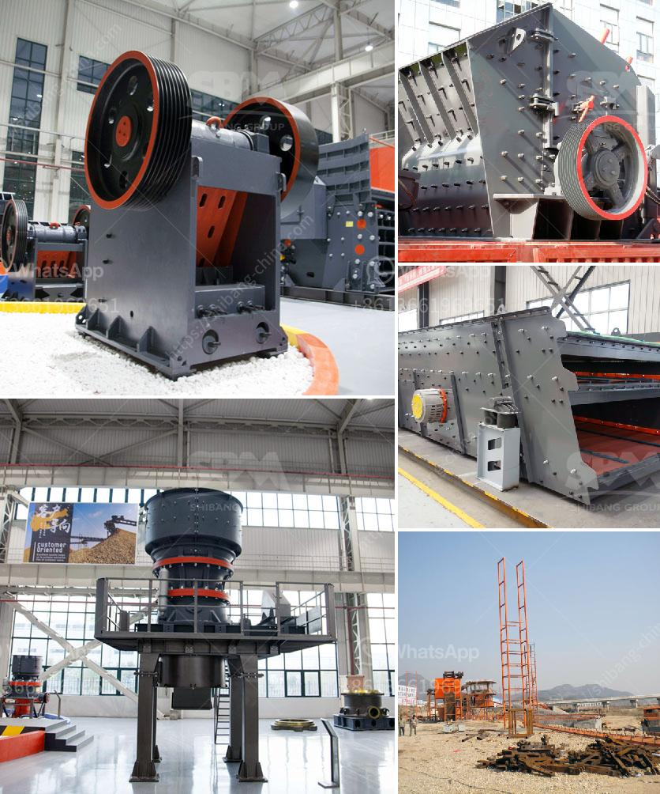

<h3>roller mill sizes</h3>
Roller mills are a type of industrial machinery used to process various materials, including grains, minerals, and chemicals. They are commonly used in the agricultural and mining industries to grind and crush materials into smaller particles. Roller mill sizes vary depending on their capabilities and the specific application they are designed for. In this article, we will explore the different roller mill sizes and their uses.

One of the primary factors that determine roller mill size is its production capacity. Roller mills are often classified based on their output, which can range from a few hundred kilograms per hour to several tons per hour. Smaller roller mills, typically designed for home or small-scale usage, can process a limited amount of material, making them suitable for hobbyists or small farmers. On the other hand, larger roller mills are capable of processing large quantities of material, making them ideal for commercial operations or large-scale production facilities.

The size of a roller mill also influences its physical dimensions and weight. Smaller roller mills are compact and lightweight, making them portable and easy to move around. This feature is particularly beneficial for those who need to transport the mill to different locations or have limited space in their facility. Larger roller mills, on the other hand, are more cumbersome and require a dedicated space due to their size and weight.

The size of the roller mill's rollers is another critical aspect to consider. The rollers are the heart of the mill and play a crucial role in the milling process. Roller mill rollers come in various sizes, typically ranging from 6 inches to 16 inches in diameter. The size of the rollers determines the amount of material that can be processed at a time. Larger rollers can accommodate higher volumes of material, reducing processing time and increasing overall productivity.

Moreover, roller mill sizes impact the fineness and uniformity of the final product. Different roller mill sizes result in different particle sizes of the processed material. Some applications require a finer grind, while others may prefer a coarser grind. The choice of roller mill size should be aligned with the desired particle size distribution of the final product for optimal performance.

In conclusion, roller mill sizes vary depending on the intended use, production capacity, physical dimensions, and desired particle size distribution. Smaller roller mills are suitable for home or small-scale usage, while larger roller mills are ideal for commercial operations or large-scale production facilities. The rollers' size determines the amount of material that can be processed at a time and affects the fineness and uniformity of the final product. When choosing a roller mill size, it is essential to consider the specific application and its requirements to ensure optimal performance and efficiency.
<h3>Contact us</h3><ul><li><strong>Whatsapp:&nbsp;<a href="https://wa.me/8613661969651">+8613661969651</a></strong></li><li><a href="https://swt.shibang-china.com/?git&amp;zhl&amp;roller mill sizes"><strong>Online Service(chat now)</strong></a></li></ul><h3>Related</h3><ul><li><a href='business plan for small scale chrome mining crusher.md'>business plan for small scale chrome mining crusher</a></li><li><a href='coal mill in power plant.md'>coal mill in power plant</a></li><li><a href='mobile crusher seller.md'>mobile crusher seller</a></li><li><a href='crushing plant for sale philippines.md'>crushing plant for sale philippines</a></li><li><a href='gravel crushing machine.md'>gravel crushing machine</a></li></ul>