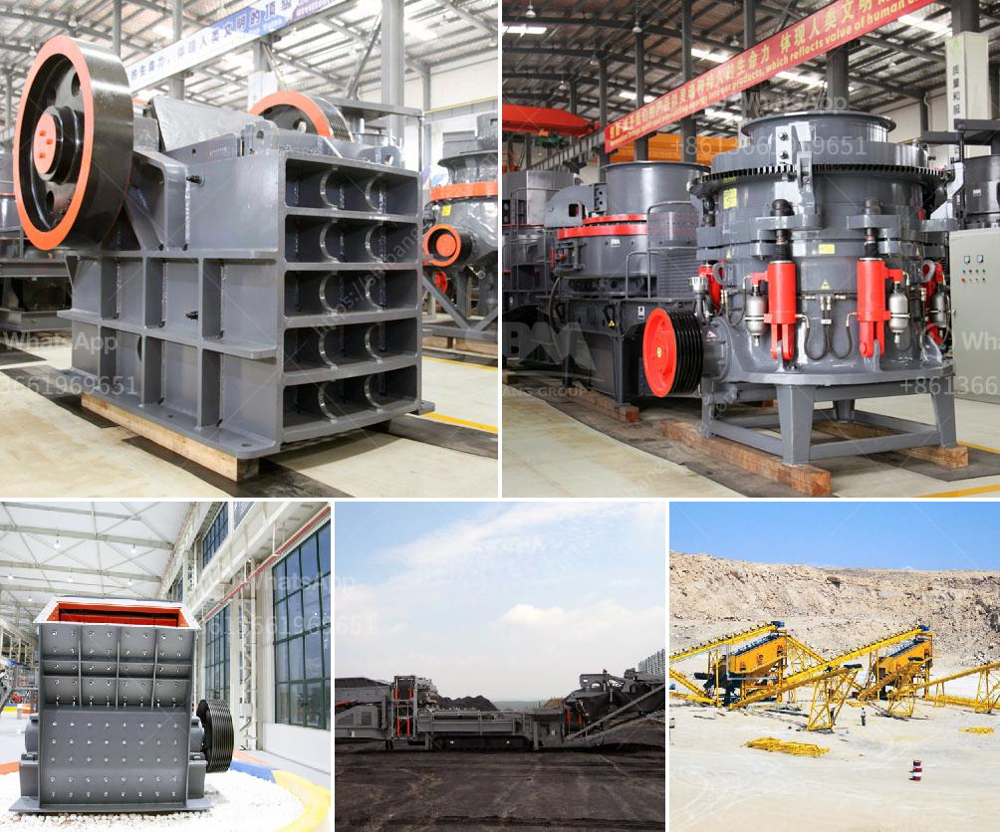

<h3>roller stone crusher</h3>
Roller stone crusher, also known as rock crusher, is an essential mechanical device in the mining machinery industry. It is mainly used to crush various minerals, such as limestone, granite, marble, basalt, quartz, iron ore, concrete, coal, coke, coal gangue, slag, etc. Roller stone crusher is an indispensable equipment in the chemical, metallurgy, cement, coal and other industries. It is also widely used in the construction of highways, railways, water conservancy and hydropower projects, and other infrastructure projects.

The roller stone crusher works in a similar way to a rolling pin, which applies force on the materials as they pass between two rollers rotating in opposite directions. The stones are crushed, split, and ground using mechanical force, forming a crushed stone of uniform size. This crushing method not only reduces the size of the rocks but also ensures that the crushed stone is of the required shape and texture.

One of the main advantages of roller stone crusher is its high efficiency and capacity. Compared to other types of crushers, such as jaw crusher or cone crusher, roller stone crusher can process more materials in the same time period. The crushing capacity of roller stone crusher can reach up to 1500 t/h, and it can crush various materials, such as granite, limestone, quartz, concrete, coal, etc.

Another advantage of roller stone crusher is its versatility. It can be used for both primary and secondary crushing. In primary crushing, the roller stone crusher reduces the size of the materials by compressing them between two rollers. In secondary crushing, the crushed stones are further ground using a roller mill or a ball mill. This versatility makes roller stone crusher suitable for various types of applications, ranging from mining and construction to chemical and metallurgical industries.

Maintenance and operation of roller stone crusher are relatively simple. The rollers are usually made of high-quality materials, such as manganese steel or alloy steel, which have excellent wear resistance. Regular lubrication and inspection of the rollers are necessary to ensure smooth operation and a long service life. Minor adjustments and repairs can be easily done by trained technicians.

In conclusion, roller stone crusher is an indispensable mechanical equipment in the mining machinery industry. It has high crushing efficiency, large capacity, and versatile applications. Its simple maintenance and operation make it a favorite choice for many industries. When choosing a roller stone crusher, it is important to consider the specific requirements of the project and select the appropriate model to ensure the best performance and efficiency.
<h3>Contact us</h3><ul><li><strong>Whatsapp:&nbsp;<a href="https://wa.me/8613661969651">+8613661969651</a></strong></li><li><a href="https://swt.shibang-china.com/?git&amp;zhl&amp;roller stone crusher"><strong>Online Service(chat now)</strong></a></li></ul><h3>Related</h3><ul><li><a href='rock crusher machines.md'>rock crusher machines</a></li><li><a href='dolomite ore processing.md'>dolomite ore processing</a></li><li><a href='cost of setting up cement plant in south africa.md'>cost of setting up cement plant in south africa</a></li><li><a href='coal machinery for coal processing crusher.md'>coal machinery for coal processing crusher</a></li><li><a href='limestone crushing plant manufacturer.md'>limestone crushing plant manufacturer</a></li></ul>