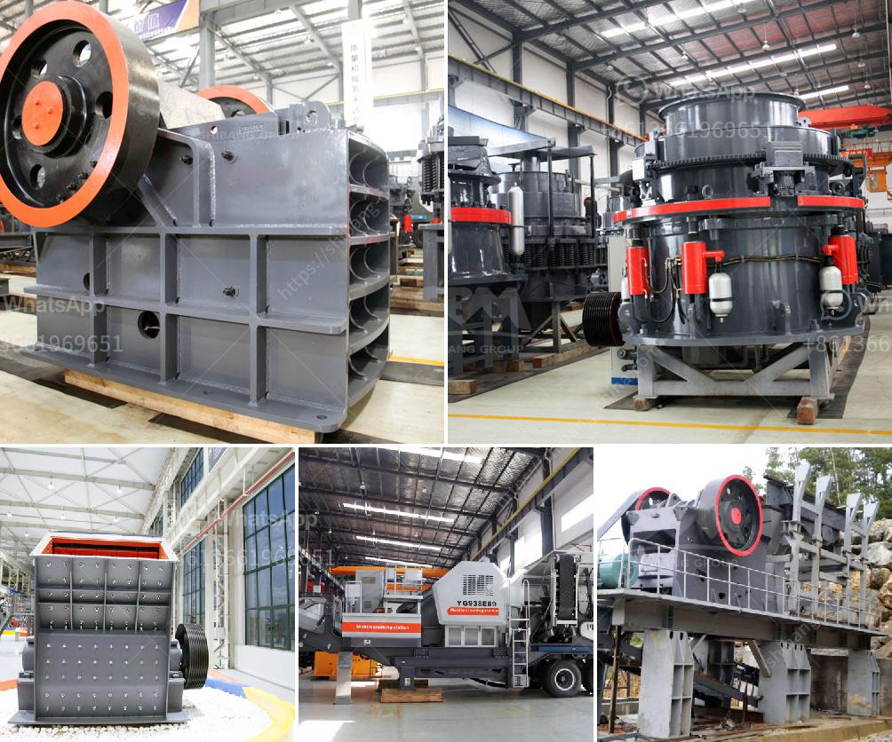

<h3>rotary dryer machine photo</h3>
In today's fast-paced world, time is of the essence. Whether it's in the agricultural, industrial, or manufacturing sector, efficient and quick drying techniques are essential. This is where the Rotary Dryer Machine comes to the rescue with its cutting-edge technology and exceptional performance. This article explores the Rotary Dryer Machine photo and how it has revolutionized the drying process, providing tangible benefits for businesses across various industries.

The Rotary Dryer Machine photo reveals a carefully crafted, innovative piece of equipment that is designed to handle large quantities of wet materials efficiently. With its cylindrical structure and rotating mechanism, this machine uses heat to remove moisture from a wide range of substances, including grains, minerals, and chemicals. The photo showcases the sturdy build and precise engineering of the rotary dryer, highlighting its ability to withstand extreme temperatures and heavy loads.

One of the most significant advantages of this drying machine is its versatility. Regardless of the material's nature or size, the Rotary Dryer Machine can adapt and deliver excellent results. From wet agricultural products, such as corn and rice, to industrial materials like sand and ores, this machine can effectively reduce moisture content, making it suitable for a myriad of applications. The photo demonstrates the machine's capacity to accommodate various input materials, emphasizing its adaptability for different industries.

Efficiency is a key factor in any drying process, and the Rotary Dryer Machine epitomizes exceptional performance. The carefully constructed design allows for optimal heat transfer, ensuring thorough and uniform drying. The photo captures the multiple heating zones within the dryer, demonstrating how heat is distributed evenly. This heat transfer mechanism not only accelerates drying but also minimizes energy consumption, making the Rotary Dryer Machine a cost-effective choice for businesses.

Moreover, maintaining the quality and integrity of the dried product is of utmost importance. The Rotary Dryer Machine photo showcases the sophisticated control system, enabling precise temperature and airflow adjustments. This level of control ensures that the final product's characteristics, such as color, texture, and aroma, are preserved. Such attention to detail is essential, especially in the food and pharmaceutical industries, where product quality is paramount.

Safety is always a concern in any industrial setting, and the Rotary Dryer Machine takes that into account. The photo highlights the comprehensive safety features incorporated into the machine's design, including thermal sensors, emergency stop buttons, and efficient exhaust systems. These safety measures safeguard workers and prevent damage to the equipment, promoting a secure working environment.

In conclusion, the Rotary Dryer Machine photo showcases the remarkable advancements in drying technology. Its innovative design, adaptability, efficiency, and safety features make it an indispensable asset in numerous industries. When time is of the essence, and high-performance drying is crucial, the Rotary Dryer Machine stands out as a reliable and efficient solution. Businesses that invest in this cutting-edge equipment can expect increased productivity, energy savings, and enhanced product quality. It is through the Rotary Dryer Machine that the drying process has been revolutionized, setting new standards in the industry.
<h3>Contact us</h3><ul><li><strong>Whatsapp:&nbsp;<a href="https://wa.me/8613661969651">+8613661969651</a></strong></li><li><a href="https://swt.shibang-china.com/?git&amp;zhl&amp;rotary dryer machine photo"><strong>Online Service(chat now)</strong></a></li></ul><h3>Related</h3><ul><li><a href='crusher machine company in spain.md'>crusher machine company in spain</a></li><li><a href='calcium carbonate crushers.md'>calcium carbonate crushers</a></li><li><a href='how much does a quarry machine cost.md'>how much does a quarry machine cost</a></li><li><a href='small portable rock crushers.md'>small portable rock crushers</a></li><li><a href='tracked jaw crusher for sale.md'>tracked jaw crusher for sale</a></li></ul>