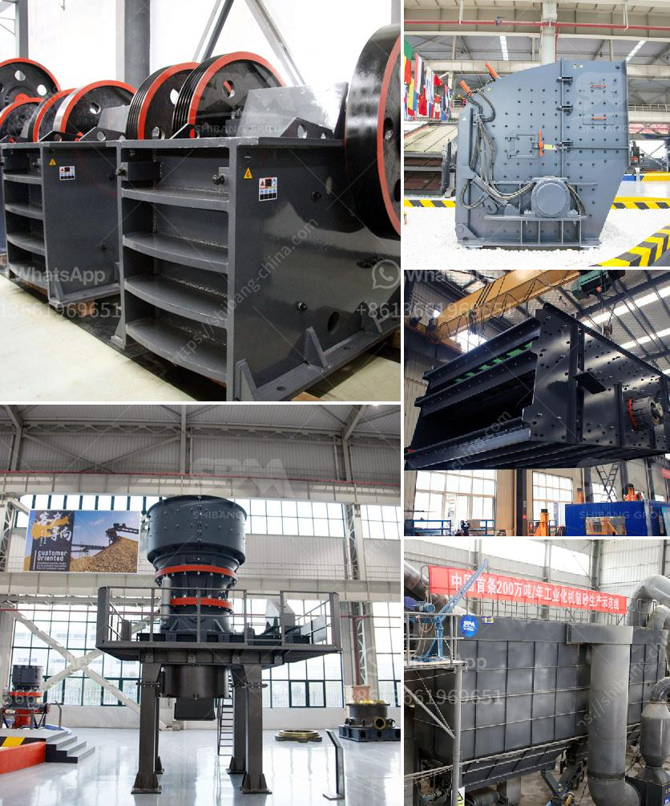

<h3>rotary hammer mills with dispenser</h3>
In today's modern world, efficient and cost-effective solutions are highly sought after in every industry. The grinding industry is no exception, constantly exploring ways to improve productivity while reducing operational expenses. Rotary hammer mills with dispensers have emerged as an innovative solution that has revolutionized the grinding industry, providing unmatched efficiency and convenience.

Traditionally, hammer mills have been utilized for grinding various materials into fine particles. However, the dispensing process has been manual, leading to significant productivity limitations. Operators had to manually load the material into the mill, causing frequent interruptions and added labor costs. This inefficient approach not only hampered productivity but also increased the risk of human errors and inconsistencies.

Recognizing these challenges, rotary hammer mills with dispensers have been developed to address these limitations head-on. These cutting-edge machines have introduced a fully automated dispensing system integrated within the mill. This game-changing feature has transformed the grinding process, significantly improving productivity and reducing operational costs.

The automated dispenser of rotary hammer mills allows for continuous feeding of materials into the mill, eliminating the need for constant human intervention. This uninterrupted flow of materials ensures consistent grinding performance, resulting in superior product quality. The precision-controlled dispensing system accurately measures and feeds the required quantity of material, minimizing waste and optimizing the utilization of resources.

In addition to enhanced productivity, rotary hammer mills with dispensers offer exceptional convenience. These machines are equipped with user-friendly interfaces, allowing operators to easily control and monitor the grinding process. With just a few clicks, operators can adjust the settings, switch between different materials, and track crucial parameters. This level of control empowers operators to achieve desired particle sizes and efficiently adapt to changing production requirements.

Another significant advantage of rotary hammer mills with dispensers is their versatility. These machines are capable of grinding a wide range of materials, including grains, feed, biomass, minerals, and various industrial by-products. Whether it's for animal feed production, biofuel processing, or mineral grinding, these mills provide a robust and efficient solution, catering to diverse industry needs.

Furthermore, rotary hammer mills with dispensers have also made significant strides in terms of sustainability. The automated dispensing system ensures the optimization of material usage, minimizing waste and reducing environmental impact. Additionally, the improved grinding efficiency also translates into energy savings, making these mills an environmentally friendly choice.

In conclusion, rotary hammer mills with dispensers have revolutionized the grinding industry, offering unparalleled efficiency and convenience. The automation and precision of the dispensing process have eliminated the limitations associated with manual feeding, significantly improving productivity and product quality. Operators now have greater control over the grinding process, achieving desired particle sizes with ease. As a versatile and sustainable solution, these mills have emerged as the go-to choice for a wide range of industries. With their ability to optimize material usage and reduce operational costs, rotary hammer mills with dispensers have truly transformed the grinding landscape.
<h3>Contact us</h3><ul><li><strong>Whatsapp:&nbsp;<a href="https://wa.me/8613661969651">+8613661969651</a></strong></li><li><a href="https://swt.shibang-china.com/?git&amp;zhl&amp;rotary hammer mills with dispenser"><strong>Online Service(chat now)</strong></a></li></ul><h3>Related</h3><ul><li><a href='50 tpd cement plant manufacturer in china.md'>50 tpd cement plant manufacturer in china</a></li><li><a href='river sand and stone mining at sabah.md'>river sand and stone mining at sabah</a></li><li><a href='silica sand washing dry process.md'>silica sand washing dry process</a></li><li><a href='crusher peru price crushing plant.md'>crusher peru price crushing plant</a></li><li><a href='clay ball mills south africa.md'>clay ball mills south africa</a></li></ul>