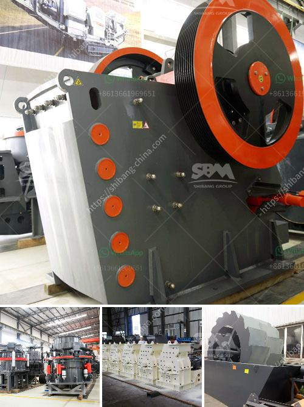

<h3>rotary kiln cement plant cost in india</h3>
Rotary kiln cement plants are on the horizon in India these days. India is the second largest producer of cement in the world, accounting for around 7-8% of global production. The growing demand for cement in India can be attributed to the rapid urbanization and infrastructure development projects taking place in the country.

A rotary kiln is a large cylindrical vessel used to process raw materials into clinker, a semi-finished form of cement. The process of rotary kiln cement plant starts with the extraction of limestone, which is then crushed and transported to the rotary kiln where it is heated to high temperatures. In the kiln, the raw materials undergo a series of chemical reactions to produce clinker. The clinker is then ground with gypsum to produce cement.

The cost of setting up a rotary kiln cement plant in India can vary depending on factors such as location, size, and capacity. The capital cost of a rotary kiln cement plant can range from several hundred crores to several thousand crores. The infrastructure cost for setting up a cement plant with a capacity of 3 million tonnes per annum (MTPA) can be more than Rs. 5,000 crores. The cost of land, building, machinery, and equipment, installation, and commissioning can account for a significant portion of the total cost.

In addition to the capital cost, there are several other costs associated with operating a rotary kiln cement plant. These include the cost of raw materials, labor, fuel, power, maintenance, and other overheads. The cost of raw materials such as limestone, clay, and gypsum can vary depending on their availability and proximity to the plant. The cost of labor and power can also be significant, especially considering the high energy requirements of a rotary kiln cement plant.

However, it is important to consider the long-term benefits and advantages of setting up a rotary kiln cement plant in India. With a growing demand for cement, especially in the infrastructure sector, the plant can generate substantial revenue and profits. Moreover, the cement industry has been identified as a key sector for employment generation in the country. A rotary kiln cement plant can create numerous job opportunities, both directly and indirectly, contributing to the overall socio-economic development of the region.

Furthermore, setting up a rotary kiln cement plant in India can help reduce the country's dependence on imports. India currently imports a significant amount of cement to meet its domestic demand. By increasing domestic production, India can save foreign exchange and strengthen its economy. It can also reduce transportation costs and carbon emissions associated with importing cement from other countries.

In conclusion, setting up a rotary kiln cement plant in India can be a significant investment, but it offers numerous long-term benefits. With the growing demand for cement in the country, such a plant can generate substantial revenue and employment opportunities. It can also help reduce import dependence and contribute to the country's economic development. However, careful planning and evaluation of costs are essential to ensure a profitable and sustainable operation.
<h3>Contact us</h3><ul><li><strong>Whatsapp:&nbsp;<a href="https://wa.me/8613661969651">+8613661969651</a></strong></li><li><a href="https://swt.shibang-china.com/?git&amp;zhl&amp;rotary kiln cement plant cost in india"><strong>Online Service(chat now)</strong></a></li></ul><h3>Related</h3><ul><li><a href='nigeria coal making process.md'>nigeria coal making process</a></li><li><a href='cement plant price in pakistan.md'>cement plant price in pakistan</a></li><li><a href='how to calculate the powder conveying rate.md'>how to calculate the powder conveying rate</a></li><li><a href='ballast crusher sale kenya.md'>ballast crusher sale kenya</a></li><li><a href='vibrating screen specification pdf.md'>vibrating screen specification pdf</a></li></ul>