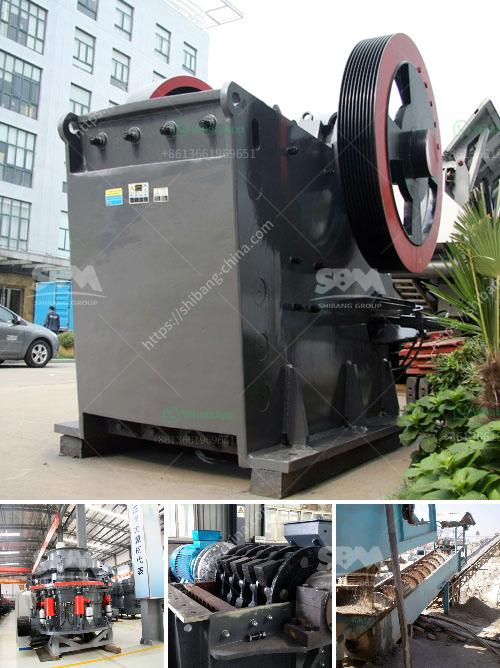

<h3>rubble crushing machine</h3>
In today’s global society, recycling has gained immense popularity due to increasing awareness of the environmental impacts of waste disposal. Construction and demolition waste, commonly referred to as rubble, has been a major concern for both developed and developing countries. To address this issue, the use of rubble crushing machines has become increasingly common in construction projects, as they provide an efficient way to recycle and reuse this waste material.

Rubble crushing machines are specialized equipment specifically designed for crushing rocks, stones, and other materials into smaller particles. These machines are highly portable and can be transported to different construction sites, making them a practical choice for many contractors. With the ability to handle various types of rubble materials, such as concrete, bricks, and asphalt, rubble crushing machines significantly contribute to reducing construction waste and promoting sustainability.

One of the main advantages of using a rubble crushing machine is its cost-effectiveness. Construction waste disposal often involves high expenses, as it requires transportation to landfills or recycling centers. By crushing rubble on-site, contractors avoid transportation costs and save valuable time. Additionally, the recycled rubble can be reused in the construction process, potentially saving more money by avoiding the purchase of new materials.

Furthermore, rubble crushing machines offer environmental benefits. By recycling construction waste, the need for new raw materials is reduced, resulting in decreased energy consumption and carbon emissions associated with extraction and manufacturing processes. The preservation of natural resources and the prevention of ecological damage are substantial environmental advantages of employing this equipment.

Apart from the financial and environmental benefits, using rubble crushing machines also enhances workplace safety. The presence of excessive rubble at construction sites can pose several hazards, such as tripping or falling. By promptly crushing and removing this waste, contractors create a safer working environment for their employees. Additionally, rubble crushing machines are equipped with advanced safety features, such as emergency stop buttons and protective covers, ensuring the well-being of workers during operation.

Investing in rubble crushing machines also contributes to the growth of the local economy. Many countries have recognized the potential of the recycling industry and are encouraging businesses to adopt sustainable practices. Consequently, the demand for rubble crushing machines has increased, stimulating the growth of local manufacturers and suppliers. The expansion of this sector leads to job creation and a boost in economic activity.

In conclusion, rubble crushing machines play a crucial role in the recycling of construction waste. With their cost-effectiveness, environmental benefits, and enhanced workplace safety, these machines have become an essential equipment for many contractors. By reducing the need for waste disposal and preserving natural resources, rubble crushing machines prove their value as a sustainable solution for the construction industry. As the world strives towards a more eco-friendly future, investing in this equipment is not only beneficial for businesses but also for the wellbeing of our planet.
<h3>Contact us</h3><ul><li><strong>Whatsapp:&nbsp;<a href="https://wa.me/8613661969651">+8613661969651</a></strong></li><li><a href="https://swt.shibang-china.com/?git&amp;zhl&amp;rubble crushing machine"><strong>Online Service(chat now)</strong></a></li></ul><h3>Related</h3><ul><li><a href='ball mills for grinding lime.md'>ball mills for grinding lime</a></li><li><a href='mining rental equipment south africa.md'>mining rental equipment south africa</a></li><li><a href='diamond mining equipment.md'>diamond mining equipment</a></li><li><a href='philippines cone crusher.md'>philippines cone crusher</a></li><li><a href='sample business plan for crushed stone.md'>sample business plan for crushed stone</a></li></ul>