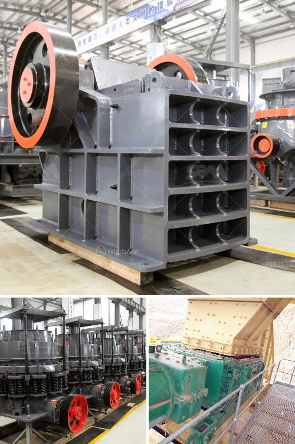

<h3>rubble recycle concrete crusher hire</h3>
Rubble recycling is the process of converting rubble into reusable construction materials. One of the most common applications for recycled rubble is in the production of recycled concrete. To facilitate this process, many companies offer rubble recycle concrete crusher hire services.

When demolished structures are crushed and recycled, they can be transformed into a variety of materials, including hardcore, sub-base, and general fill. The primary tool used for this purpose is a rubble recycle concrete crusher. These highly efficient machines crush rubble to create a reusable construction material.

Hiring a rubble recycle concrete crusher is not just beneficial for the environment, but it can also save you money. With landfill charges increasingly on the rise, disposing of your rubble can be an expensive task. By recycling it, you not only reduce the need for landfill space but also avoid costly disposal fees. Additionally, using recycled rubble in construction can be a cost-effective alternative to buying new materials.

One of the leading players in the rubble recycle concrete crusher hire industry is ABC Crushing. This company provides a range of services, including crusher hire, site clearance, and plant hire throughout the UK. Their crushers are capable of crushing a wide range of materials, including concrete, brick, and stone.

Hiring a rubble recycle concrete crusher from ABC Crushing is a straightforward process. Their team of experts will assess your requirements and recommend the most suitable crusher for your project. Once you have made the booking, they will deliver the crusher to your site and provide the necessary instructions and training for safe and efficient operation.

Using a rubble recycle concrete crusher can bring several benefits to your construction projects. Firstly, it allows you to reuse and recycle materials on-site, reducing the need for transportation and minimizing the carbon footprint. By crushing and recycling rubble, you are actively contributing to a more sustainable construction industry.

Furthermore, recycled concrete has proven to be a durable and reliable material. It can be used for a variety of applications, including road sub-base, aggregates for concrete production, and even decorative purposes. The use of recycled materials in construction has become increasingly popular and is often preferred by clients who value sustainable practices.

In conclusion, rubble recycle concrete crusher hire services offer an environmentally friendly and cost-effective way to deal with demolished materials. These crushers have the capacity to transform rubble into reusable construction materials such as hardcore, sub-base, and general fill. When choosing a crusher hire company, it is essential to consider their experience, expertise, and reputation in the industry. ABC Crushing is a reputable provider of rubble recycle concrete crusher hire services, offering reliable machinery and professional support. By opting for their services, you can contribute to a more sustainable construction industry while saving money on disposal fees.
<h3>Contact us</h3><ul><li><strong>Whatsapp:&nbsp;<a href="https://wa.me/8613661969651">+8613661969651</a></strong></li><li><a href="https://swt.shibang-china.com/?git&amp;zhl&amp;rubble recycle concrete crusher hire"><strong>Online Service(chat now)</strong></a></li></ul><h3>Related</h3><ul><li><a href='used crushers prices in nigeria.md'>used crushers prices in nigeria</a></li><li><a href='raymond mill mumbai and africa.md'>raymond mill mumbai and africa</a></li><li><a href='slag crushing plant.md'>slag crushing plant</a></li><li><a href='dolomite process peritidal subtidal.md'>dolomite process peritidal subtidal</a></li><li><a href='different type of grinding mills.md'>different type of grinding mills</a></li></ul>