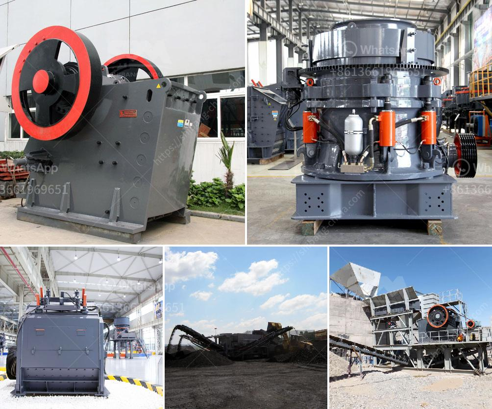

<h3>rumus menghitung berat besi stanliss</h3>
Besi stainless steel adalah salah satu material yang sering digunakan dalam berbagai aplikasi konstruksi dan industri. Kebanyakan orang mengenal stainless steel sebagai material yang tahan karat dan memiliki kekuatan yang tinggi. Untuk menghitung berat besi stainless steel, Anda dapat menggunakan rumus sederhana yang akan dijelaskan dalam artikel ini.

Panjang, lebar, dan tebal dapat diukur dalam milimeter (mm) atau meter (m), disesuaikan dengan unit yang lebih mudah untuk digunakan.

Massa jenis stainless steel berkisar antara 7,7 hingga 8,0 g/cm³, tergantung pada jenis dan kualitasnya. Anda dapat mencari kerapatan spesifik pada lembaran data teknis stainless steel yang Anda gunakan.

Untuk lebih memahami bagaimana rumus ini bekerja, mari kita lihat contoh penghitungan berat besi stainless steel:

Misalkan Anda memiliki sehelai lembaran stainless steel dengan panjang 1000 mm, lebar 500 mm, dan ketebalan 2 mm. Massa jenis stainless steel yang Anda gunakan adalah 7,9 g/cm³.

Rumus ini dapat digunakan pada berbagai bentuk besi stainless steel, seperti pipa, batangan, atau plat. Anda hanya perlu mengukur dimensi yang relevan dan memasukkannya ke dalam rumus ini.

Penting untuk diingat bahwa rumus ini hanya memberikan perkiraan berat yang akurat. Beberapa faktor seperti pengaruh dari proses manufaktur, toleransi dimensi, dan pengecoran dapat mempengaruhi berat sebenarnya.

Selain itu, jika Anda ingin menghitung berat besi stainless steel dalam berbagai format lainnya, seperti kilogram (kg) atau ton, Anda dapat menggunakan konversi unit yang sesuai.

Rumus menghitung berat besi stainless steel adalah alat yang berguna untuk memperkirakan berat material dalam proyek konstruksi atau industri. Dengan menggunakan rumus ini, Anda dapat menghemat waktu dan usaha dalam menghitung berat besi stainless steel secara manual.

Namun, penting untuk mengingat bahwa rumus ini hanya memberikan estimasi yang akurat, dan dapat dikomplemen sedia rumus lain yang lebih spesifik tergantung pada kebutuhan Anda.
<h3>Contact us</h3><ul><li><strong>Whatsapp:&nbsp;<a href="https://wa.me/8613661969651">+8613661969651</a></strong></li><li><a href="https://swt.shibang-china.com/?git&amp;zhl&amp;rumus menghitung berat besi stanliss"><strong>Online Service(chat now)</strong></a></li></ul><h3>Related</h3><ul><li><a href='calcium carbonate pulverizer suppliers.md'>calcium carbonate pulverizer suppliers</a></li><li><a href='cement manufacturing process pdf.md'>cement manufacturing process pdf</a></li><li><a href='power of a roller mill.md'>power of a roller mill</a></li><li><a href='grinding plant in rajasthan.md'>grinding plant in rajasthan</a></li><li><a href='buy stone crusher machine in saudi arabia.md'>buy stone crusher machine in saudi arabia</a></li></ul>