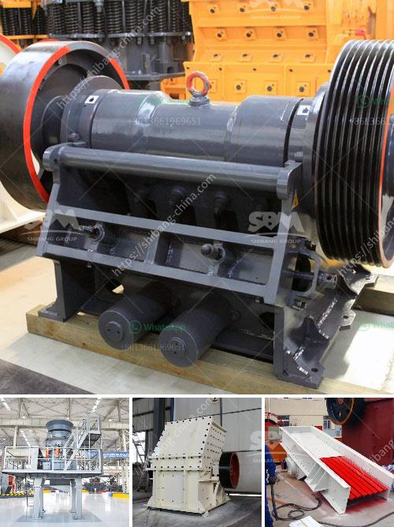

<h3>russia stone mining equipment</h3>
Russia has always been known for its vast and rich natural resources, and stone mining is no exception. With a landmass covering more than 17 million square kilometers, there is no shortage of opportunities for mining in Russia. The country is home to various types of stones, including granite, marble, limestone, and slate, which are widely used in construction and architecture.

The stone mining industry in Russia has a long and storied history, dating back to ancient times. The country's architectural landmarks, such as the stunning cathedrals and palaces, are a testament to the skill and craftsmanship of Russian stonemasons. Today, modern technology and state-of-the-art equipment play a crucial role in enhancing the efficiency and productivity of stone mining operations in Russia.

One of the leading manufacturers of stone mining equipment in Russia is the Uralmashplant company. They offer a wide range of crushing and screening equipment for various industries, such as mining, quarrying, and construction. For the past decade, Uralmashplant has been actively participating in the development of the Russian stone mining industry.

This company, known for its robust and reliable equipment, provides crushers and screens that can handle even the most challenging materials. Their machines are equipped with advanced technology, including hydraulic adjustment systems, overload protection, and efficient dust control. These features ensure high productivity and minimize downtime, making them ideal for the demanding conditions of stone mining in Russia.

Another key player in the Russian stone mining equipment market is the Volgaburmash company. They specialize in manufacturing drilling tools and equipment for geological exploration, mining, and construction. Their drilling rigs and tools are widely used in stone mining operations, providing reliable and efficient solutions for extracting minerals from the earth.

Volgaburmash's drilling equipment is designed to withstand the harsh conditions of stone mining, including extreme temperatures, rugged terrains, and high-pressure environments. The company's products, such as core barrels, drill bits, and hammers, are known for their durability and performance, ensuring successful drilling operations in Russia's stone mines.

In recent years, technological advancements have revolutionized the stone mining industry in Russia. Automation and digitalization have made mining processes more efficient and safer. Companies like Uralmashplant and Volgaburmash have embraced these developments, integrating automation into their equipment and offering solutions that incorporate data analytics and remote monitoring.

Furthermore, environmental considerations are of utmost importance in stone mining. In response, companies are increasingly adopting sustainable practices in their operations. Efforts are being made to minimize the energy consumption and carbon emissions associated with stone mining equipment, and to ensure responsible environmental management throughout the entire mining process.

In conclusion, the stone mining industry in Russia continues to thrive, thanks to the country's abundant natural resources and the technological advancements in mining equipment. Companies like Uralmashplant and Volgaburmash are leading the way with their innovative and efficient solutions. With a strong focus on sustainability, the future of stone mining in Russia looks promising, contributing to the nation's economic growth and the development of its architectural wonders.
<h3>Contact us</h3><ul><li><strong>Whatsapp:&nbsp;<a href="https://wa.me/8613661969651">+8613661969651</a></strong></li><li><a href="https://swt.shibang-china.com/?git&amp;zhl&amp;russia stone mining equipment"><strong>Online Service(chat now)</strong></a></li></ul><h3>Related</h3><ul><li><a href='conveyor belts manufacturers south africa.md'>conveyor belts manufacturers south africa</a></li><li><a href='alluvial gold washing plants.md'>alluvial gold washing plants</a></li><li><a href='raymond mill price list.md'>raymond mill price list</a></li><li><a href='chrome wash plant operational diagram.md'>chrome wash plant operational diagram</a></li><li><a href='100 ton per day cement making plant.md'>100 ton per day cement making plant</a></li></ul>