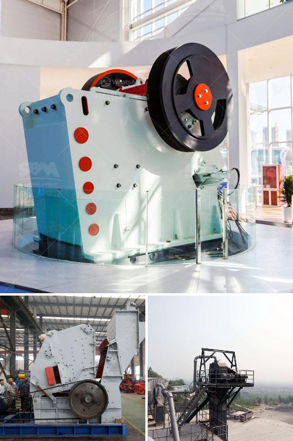

<h3>sale ghana grinding crusher</h3>
Ghana, a West African country known for its rich natural resources and vibrant cultural heritage, has been steadily growing its industrial sector in recent years. One important component of this growth is the mining industry, which relies heavily on equipment such as grinding crushers. These crushers are essential for the processing of minerals, ores, and other materials, and play a vital role in increasing the productivity of mining operations. In this article, we will explore the sale of grinding crushers in Ghana, highlighting their importance and availability in the local market.

Grinding crushers are machines designed to break down large rocks and minerals into smaller, more manageable pieces. They are used extensively in the mining industry to prepare materials for further processing. The primary purpose of grinding crushers is to reduce the size of ore or rock particles and facilitate the extraction of valuable minerals. Without these essential machines, the mining process would be significantly slower and less efficient, resulting in lower productivity and reduced profitability.

Ghana's mining sector has experienced significant growth over the years, attracting both local and international investors. As a result, there is a high demand for mining equipment, including grinding crushers. Thankfully, various suppliers and manufacturers cater to this demand, providing a wide range of grinding crushers suitable for different mining operations.

Local manufacturers, such as Multotec Ghana and FLSmidth Ghana, produce grinding crushers specifically designed to meet the unique needs of the Ghanaian mining industry. These crushers are built to withstand the harsh conditions prevalent in mining sites and are equipped with advanced features to improve efficiency and performance.

In addition to local manufacturers, several international companies, including Sandvik and Metso, operate in Ghana and offer a comprehensive range of grinding crushers to meet the diverse requirements of mining operations. These international suppliers have established a strong presence in the country and offer reliable products that conform to global quality standards.

There are several advantages to purchasing grinding crushers locally in Ghana. Firstly, by buying from local manufacturers, mining companies can support the domestic economy and contribute to the growth of the local industrial sector. It also ensures easier accessibility to spare parts and after-sales services, as local manufacturers are more likely to have a robust support system in place.

Buying grinding crushers in Ghana also allows mining companies to benefit from lower shipping costs, as the products do not need to be imported from distant locations. Additionally, purchasing locally provides opportunities for customization, as manufacturers can adapt the crushers to suit specific mining requirements.

Grinding crushers play a crucial role in the mining industry in Ghana, contributing to the efficient extraction of minerals and ores. With the country's growing mining sector, there is a steady demand for grinding crushers, which are readily available from both local and international suppliers. By purchasing these essential machines locally, mining companies can support the domestic economy, ensure easier accessibility to spare parts, and enjoy the benefits of customization.
<h3>Contact us</h3><ul><li><strong>Whatsapp:&nbsp;<a href="https://wa.me/8613661969651">+8613661969651</a></strong></li><li><a href="https://swt.shibang-china.com/?git&amp;zhl&amp;sale ghana grinding crusher"><strong>Online Service(chat now)</strong></a></li></ul><h3>Related</h3><ul><li><a href='industrial roller mill.md'>industrial roller mill</a></li><li><a href='companies crushing plant.md'>companies crushing plant</a></li><li><a href='lime production plant.md'>lime production plant</a></li><li><a href='used cone crusher for sale ton per hour.md'>used cone crusher for sale ton per hour</a></li><li><a href='distributors of conveyor belts in mexico.md'>distributors of conveyor belts in mexico</a></li></ul>