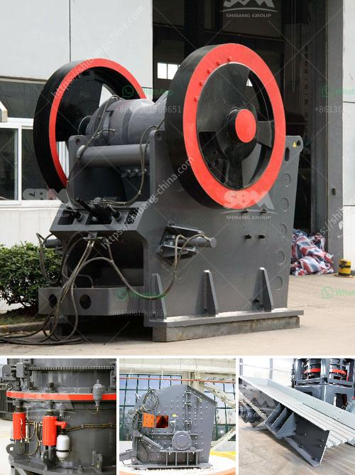

<h3>sale of old hammer crusher</h3>
The sale of old hammer crusher is a hot topic on the Internet. With the rapid development of society, the hammer crusher has been widely used in various industries. It has been continuously updated and innovated, and plays a vital role in the construction and building materials industry.

Old hammer crushers are being replaced by new ones in large numbers. The old hammer crusher has a low output and high energy consumption, and its wearing parts are also badly worn. If it is used in building materials industry or mining industry, the cost of replacing vulnerable parts will increase greatly, which will affect the production efficiency and increase the production cost. Therefore, many users are considering selling their old hammer crushers and replacing them with new ones.

Another reason for the sale of old hammer crushers is that the old models have been eliminated by the market due to their backward technology and low efficiency. With the continuous development of science and technology, the technology of hammer crushers is also constantly improving. The new models have higher crushing efficiency, larger crushing ratio, and better performance. They are also equipped with various automated systems to improve production efficiency and reduce labor costs.

When selling old hammer crushers, many users also consider the environmental protection factor. The old hammer crushers often produce noise, dust and other pollution during operation. This not only affects the production environment, but also poses a threat to the health of workers. The new hammer crushers are equipped with noise reduction and dust removal devices, which effectively reduce environmental pollution and create a green production environment.

However, it is worth mentioning that the sale of old hammer crushers also faces certain challenges. The market demand for old models may be relatively low, which affects the selling price. In addition, the condition of the old hammer crushers also affects the selling price. If the old hammer crushers are seriously worn or damaged, the selling price will be greatly reduced.

To sell old hammer crushers, it is recommended to choose a reliable and professional trading platform. These trading platforms have a large user base and can effectively match buyers and sellers. They can also provide evaluation and inspection services, which ensure the quality of the old hammer crushers and protect the rights and interests of both parties.

In conclusion, the sale of old hammer crushers is an inevitable trend in the current market. With the continuous improvement of technology and the increasing demand for efficiency and environmental protection, the old models have been gradually replaced by new ones. To sell old hammer crushers, it is necessary to choose the right trading platform and ensure the quality of the products. This will not only help users recover part of the investment, but also promote the sustainable development of the industry.
<h3>Contact us</h3><ul><li><strong>Whatsapp:&nbsp;<a href="https://wa.me/8613661969651">+8613661969651</a></strong></li><li><a href="https://swt.shibang-china.com/?git&amp;zhl&amp;sale of old hammer crusher"><strong>Online Service(chat now)</strong></a></li></ul><h3>Related</h3><ul><li><a href='kenya quartz crushing.md'>kenya quartz crushing</a></li><li><a href='equipment for a mini quarry plant.md'>equipment for a mini quarry plant</a></li><li><a href='malaysia stone crusher price.md'>malaysia stone crusher price</a></li><li><a href='vertical mill coal.md'>vertical mill coal</a></li><li><a href='portable portable hammer mill.md'>portable portable hammer mill</a></li></ul>