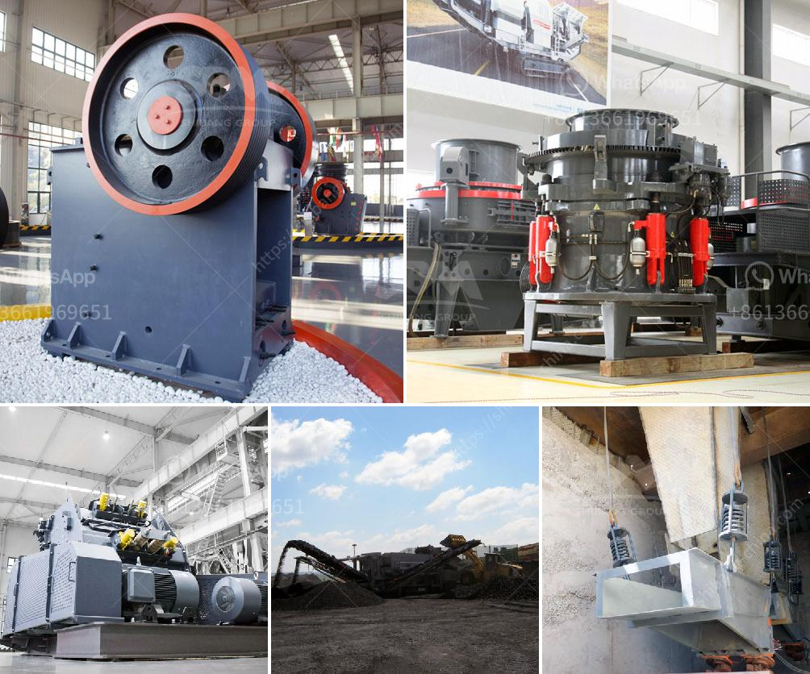

<h3>sale of roll mill machine</h3>
Roll forming is a widely used process in various industries, including automotive, construction, and manufacturing. This method involves continuous bending of a long strip of metal into a desired shape by passing it through a series of roll stands. To ensure the accuracy and quality of the final product, a roll mill machine is a crucial piece of equipment in the roll forming process.

A roll mill machine, also known as a rolling mill or roll forming machine, plays a significant role in shaping metal sheets into various forms. It consists of a set of rollers that support and guide the metal strip during the forming process. The rollers apply pressure and gradually bend the metal strip into the desired shape, resulting in a continuous, precise, and uniform product.

When considering the purchase of a roll mill machine, there are several key factors to consider. The first is the capacity of the machine, which determines the maximum width and thickness of the metal strip it can handle. It is essential to choose a machine with adequate capacity to meet the specific requirements of your production processes.

Another critical aspect is the number and configuration of rollers. A roll mill machine can have a varying number of rollers, depending on the complexity and intricacy of the shapes you need to produce. Machines with more rollers allow for a greater degree of customization and flexibility in forming various metal profiles.

The quality and durability of the rollers themselves are also crucial considerations. Rollers need to be made from robust materials, such as hardened steel or carbide, to withstand the high pressure and strain exerted during the roll forming process. High-quality rollers not only ensure the longevity of the machine but also result in higher precision and finer finishes on the formed products.

In recent years, there have been significant advancements in roll mill machine technology. Many modern machines are equipped with computer numerical control (CNC) systems, allowing for precise control and automation of the roll forming process. CNC-controlled roll mill machines provide greater accuracy, faster production speeds, and reduced material waste, making them a preferred choice for many manufacturers.

Furthermore, some roll mill machines incorporate additional features, such as laser or ultrasonic sensors, to detect and correct any deviations or irregularities in the forming process. These advanced technologies further enhance the accuracy and quality of the final product, ensuring its adherence to strict industry standards.

When it comes to the sale of roll mill machines, it is essential to source them from reputable manufacturers or suppliers. A reliable supplier will offer not only high-quality machines but also comprehensive technical support, including installation, training, and maintenance services. It is crucial to choose a supplier that has a track record of delivering reliable and efficient roll mill machines to ensure trouble-free operation and long-term satisfaction.

In conclusion, the sale of roll mill machines is a significant investment for businesses involved in roll forming processes. These machines play a pivotal role in shaping metal strips into complex profiles with high precision and efficiency. When purchasing a roll mill machine, consider factors such as capacity, roller configuration, roller quality, and technological advancements to ensure optimal performance and reliability. By selecting a reputable supplier, businesses can acquire a roll mill machine that meets their specific requirements, ultimately leading to increased productivity and profitability.
<h3>Contact us</h3><ul><li><strong>Whatsapp:&nbsp;<a href="https://wa.me/8613661969651">+8613661969651</a></strong></li><li><a href="https://swt.shibang-china.com/?git&amp;zhl&amp;sale of roll mill machine"><strong>Online Service(chat now)</strong></a></li></ul><h3>Related</h3><ul><li><a href='gold crusher for sale in china.md'>gold crusher for sale in china</a></li><li><a href='feldspar refining and processing equipment.md'>feldspar refining and processing equipment</a></li><li><a href='gold milling plant cost.md'>gold milling plant cost</a></li><li><a href='coal crusher design.md'>coal crusher design</a></li><li><a href='spec vibrating screen.md'>spec vibrating screen</a></li></ul>