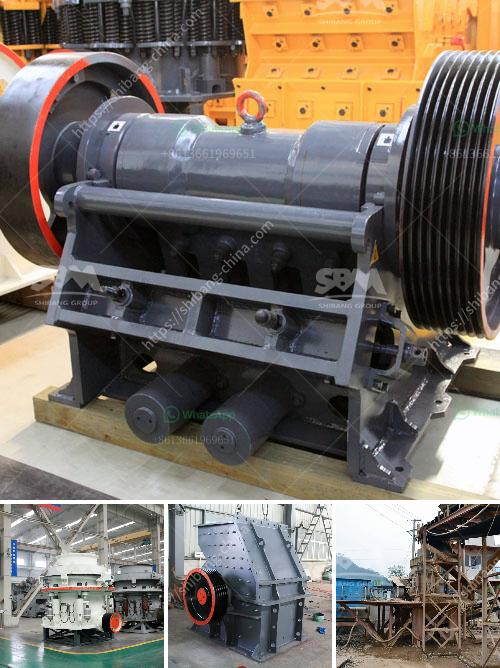

<h3>sample business plan for crushed stone</h3>
Crushed stone is an essential component for construction projects, ranging from residential buildings to highways and railways. Despite the variety of sizes and uses, crushed stone is typically sold in bulk quantities. Due to its widespread demand, starting a crushed stone business can be a profitable endeavor with the right planning. This article presents a sample business plan for crushed stone that can be used as a blueprint for success.

The executive summary provides an overview of the business plan, highlighting the key elements and objectives. It includes a brief description of the company’s mission, products, target market, and financial projections.

This section provides a detailed introduction to the company, including its history, location, legal structure, and key personnel. It also outlines the company’s unique selling proposition (USP) and competitive advantage in the crushed stone market.

The market analysis section examines the demand for crushed stone in the target market, as well as the competitive landscape. It outlines the various applications of crushed stone and identifies potential customers, such as construction companies, landscaping firms, and government agencies. Additionally, it analyzes the pricing dynamics and competitor offerings to determine the company’s positioning.

The marketing and sales strategy outlines how the company will attract and retain customers. It includes a comprehensive marketing plan that incorporates online and offline channels, such as search engine optimization, social media advertising, trade shows, and direct sales. This section also identifies the pricing strategy, sales targets, and customer retention initiatives.

The operations plan outlines the process of extracting, crushing, and delivering the crushed stone to customers. It includes a detailed description of the equipment, machinery, and facilities required, as well as the estimated operational costs. Additionally, it addresses health and safety regulations and identifies any specialized permits or licenses needed.

The financial projections section provides an estimate of the company’s revenue, expenses, and profitability over the next three to five years. It includes a sales forecast based on anticipated market demand and pricing, as well as cost projections for labor, equipment, raw materials, and overhead. This section also presents the company’s break-even analysis and a statement of cash flows.

The risk analysis and mitigation section identifies potential risks and challenges that could impact the company’s success. It includes a contingency plan for adverse scenarios, such as fluctuations in demand, increased competition, or equipment breakdowns. This section also outlines the insurance coverage and risk mitigation strategies the company will implement.

Starting a crushed stone business requires careful planning and execution. By following a comprehensive business plan like the one presented here, entrepreneurs in the crushed stone industry can navigate the challenges and maximize their chances of success. While this sample business plan serves as a framework, it is essential to adapt it to the specific needs and circumstances of your venture. With determination and strategic thinking, a crushed stone business can thrive in the competitive construction market.
<h3>Contact us</h3><ul><li><strong>Whatsapp:&nbsp;<a href="https://wa.me/8613661969651">+8613661969651</a></strong></li><li><a href="https://swt.shibang-china.com/?git&amp;zhl&amp;sample business plan for crushed stone"><strong>Online Service(chat now)</strong></a></li></ul><h3>Related</h3><ul><li><a href='mobile stone crusher 120 tph price.md'>mobile stone crusher 120 tph price</a></li><li><a href='quarry crushing line.md'>quarry crushing line</a></li><li><a href='equipment costs for cement plant.md'>equipment costs for cement plant</a></li><li><a href='ball mill to grind quartz.md'>ball mill to grind quartz</a></li><li><a href='calcite grinding machine manufacturer in udaipur.md'>calcite grinding machine manufacturer in udaipur</a></li></ul>