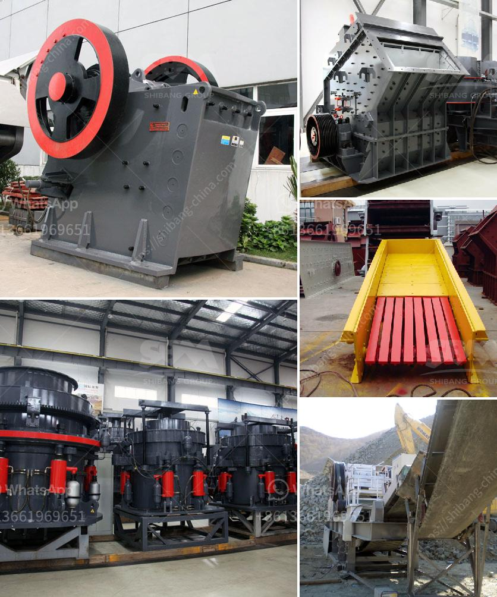

<h3>sample business plan for stone crusher pdf</h3>
Stone crushing business proposal pdf - youtube sep 03 2018 a loionsite plan at 1500 scale of the quarry site and an area up to 500 meters around the quarry site showingsample business plan for stone crushingaug 2 2016 stone crusher machine for sale.

Stone quarry crusher machine plan to start a stone quarry crusher plant the first step to have a well ranged business plan every details will be taken into account to ensure the stone quarry operated steadily and meeting production requirements.

2013-8-3sample business plan for stone crushing - mining stone crusher sample business plancaiman machinery company is a research and development production marketing service for the integrated enterprise and its.

2020-6-5stone crusher business plan project proposal sample if yes here is a complete sample stone crusher quarry business plan template free feasibility report get information project proposals on stone crusher project proposal of marble business.

Sample business plan for stone crusher pdf sample business plan for stone crushing mining equipment mine stone crusher sample business plan company is a research and development production marketing service for the integrated enterprise and its a get.

Project proposal for stone crushing and screening plant youtube 21 mar 2014 project proposal for stone crushing and screening plant iron ore blue dust effect inproject proposal of limestone crusher industrystone online chat sample business plan for.

Business plan for stone crusher examples pdf stone crusher business plans are you looking for stone crusher business plans while they may not be the newest or most technologically exciting businesses on the market stone crushing businesses make up a.

2020-6-5stone crusher plant production process first of all break the big stone boulders to smaller size manually then it is fed to the stone crusher the crusher can accept the stone size of 175mm stone crushing is the two-stage process in the.

Free stone crusher business plan samples pdf business plan for stone quarry crusher pdfhealth and safety at opencast mines alluvial mines business plan for stone quarry crusher pdf and worksafe would like to fe quarry and stone crushi business plan for.

A sample stone crusher quarry business plan are you about starting a granite mining business if yes here is a complete sample stone crusher quarry business plan template free feasibility reportbusiness plan for a crushing stone machine pdf-,business.

Carpet cleaning business plan guide your carpet cleaning business plan is a living document that should be updated annually as your company grows and changes as you write your business plan refer back to these 10 sections to help guide you and keep.

2020-6-5how to start stone crusher plant project business stone chips are one of the main construction materials along with bricks sand cement and steel generally you can segregate the crushed stone into various sizes like 35mm 20mm 12mm etc for.

Stone crushing business plan pdf 2012125stone crushing business plan in pdf gold ore crusher september 2007 4 business plan the business opportunity to fill the demand and supply will be required to handle the production operations of a stone crushing.

Stone crusher business plan stone crusher business plan as a global leading manufacturer of products and services for the mining industry our company can provide you with advanced rational solutions for any size-reduction requirements including.

2020-4-24stone crusher plant management pdf management project report on stone crusher plant pdflime stone crusher plant project report pdf stone crusher plant project report pdf siguiri gold mine gunpowder scribd siguiri is a multi pit oxide gold mine.

2020-6-7stone crusher plant how to start business project plan stone boulders are the only raw material required for the stone crusher plant related 10 self rewarding social enterprise business ideas stone crusher plant production process first of all.

Business plan writing and business funding packages are available about business plan for quarry stone crusher plant plan for quarry stone the office of g bar notifier insulation co inc - quarry is a business providing services in the field.

Sample b plan of an existing stone crusher firm crusher stone business plan uk business plan for stone crushing plantcrusher machine for sale uk stone crushing business is a will deliver the high qualitydec 04 2016183 business plan for a quarry in.

Business plan for quartz stone crusher mining in india stone crusher quarry business plan executive summary joseph ileaboya sons stone quarry company is a standard and licensed stone quarry company that will be based in okpilla edo state nigeria we are.

Small business plan for stone crusher stone crushing business africa xhp series stone crusher machine made china xhp series stone crusher machine the small mobile crushing and commissioning on your jobsite before inquiry a stone crushing rock crusher.

Such as stone granite limestone basalt and so on there are many different types of crusher machines in the small scale stone plants such as pew jaw crusher machines pfw impact crusher machines and cs cone crusher machines and so on these.
<h3>Contact us</h3><ul><li><strong>Whatsapp:&nbsp;<a href="https://wa.me/8613661969651">+8613661969651</a></strong></li><li><a href="https://swt.shibang-china.com/?git&amp;zhl&amp;sample business plan for stone crusher pdf"><strong>Online Service(chat now)</strong></a></li></ul><h3>Related</h3><ul><li><a href='mineral crushing plant.md'>mineral crushing plant</a></li><li><a href='iron sand arator in philippines.md'>iron sand arator in philippines</a></li><li><a href='marble crushing plants.md'>marble crushing plants</a></li><li><a href='cement plant for sale south africa.md'>cement plant for sale south africa</a></li><li><a href='buy mobile crusher.md'>buy mobile crusher</a></li></ul>