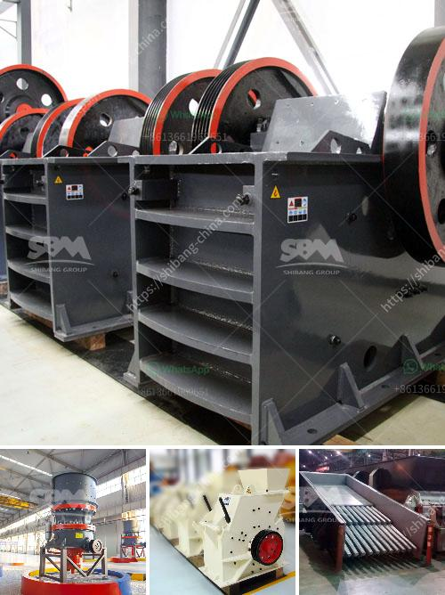

<h3>sample proposal to supply mining equipment</h3>
This is a sample proposal on behalf of Greenfield Metals Limited, a registered mining company in Nigeria, to the Ministry of Mines and Steel Development, the regulatory body for mining in Nigeria.

Greenfield Metals Limited is proposing to supply mining equipment to the Ministry of Mines and Steel Development for their mining operations in Kwara State. With the advancement in mining technology and equipment, Greenfield Metals Limited is poised to leverage this opportunity to become a major player in the mining sector in Nigeria.

The objective of this proposal is to present our expertise, experience, and capability in providing mining equipment to the Ministry of Mines and Steel Development. We have carefully studied the mining operations in Kwara State and have identified the areas where we can assist you in achieving your mining objectives.

1. Equipment Supply: We will supply all the required mining equipment and machinery needed for efficient exploration, exploitation, and processing operations. Some of the equipment includes excavators, dumpers, pay loaders, bulldozers, drilling rigs, crushers, and conveyors.

2. Training and Skill Development: We propose to provide training to the staff of the Ministry of Mines and Steel Development in the operation and maintenance of the mining equipment. Our team of experts will conduct workshops and hands-on training sessions to ensure that your staff has the necessary skills to operate the equipment effectively and efficiently.

3. After-sales Support: We commit to providing prompt and efficient after-sales support to ensure the smooth operation and maintenance of the mining equipment. We will have a dedicated team of engineers and technicians available round the clock to address any technical issues or emergencies.

4. Quality Assurance: All the equipment supplied will be of the highest quality and meet the industry standards. We will provide all necessary certifications and documentation for each equipment delivered.

Greenfield Metals Limited is confident in delivering high-quality mining equipment and providing the necessary support to the Ministry of Mines and Steel Development in achieving their mining objectives. We have a proven track record of successfully supplying mining equipment to various mining companies in Nigeria. With our expertise, experience, and commitment to customer satisfaction, we believe that we are the right partner for your mining equipment needs.

We look forward to the opportunity to discuss this proposal further and provide any additional information or clarifications as needed. We are confident that by engaging Greenfield Metals Limited, the Ministry of Mines and Steel Development will benefit greatly by having a reliable and efficient supply of mining equipment.
<h3>Contact us</h3><ul><li><strong>Whatsapp:&nbsp;<a href="https://wa.me/8613661969651">+8613661969651</a></strong></li><li><a href="https://swt.shibang-china.com/?git&amp;zhl&amp;sample proposal to supply mining equipment"><strong>Online Service(chat now)</strong></a></li></ul><h3>Related</h3><ul><li><a href='coal powder making machine.md'>coal powder making machine</a></li><li><a href='mining rental equipment south africa.md'>mining rental equipment south africa</a></li><li><a href='specification of jaw crusher.md'>specification of jaw crusher</a></li><li><a href='diagram of stone crusher operation.md'>diagram of stone crusher operation</a></li><li><a href='buy and sell conveyor belts in south africa.md'>buy and sell conveyor belts in south africa</a></li></ul>