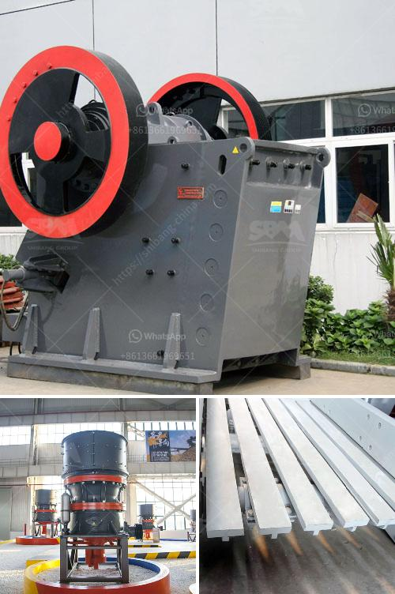

<h3>sand and gravel dryer equipment qatar</h3>
Sand and gravel are essential materials in the construction industry, used for the development of roads, buildings, and infrastructure. In Qatar, where rapid urbanization and expansion are taking place, the demand for sand and gravel is soaring. To meet this growing demand, efficient equipment such as sand and gravel dryer machines are being utilized, streamlining the drying process and ensuring a constant supply of these crucial materials.

The sand and gravel dryer equipment in Qatar plays a pivotal role in drying these materials efficiently, thereby enhancing productivity and reducing costs. These dryers typically use natural gas or diesel as fuel to generate heat, facilitating the drying process. The equipment consists of a rotating drum, in which the raw material – damp sand or gravel – is fed into one end while hot air is blown into the other end. As the drum rotates, the hot air comes into contact with the material, drying it effectively.

One of the key advantages of sand and gravel dryer equipment is its ability to dry the material uniformly. This ensures that the sand or gravel being outputted is of consistent quality and moisture content, making it suitable for various construction applications. Moreover, the efficient drying process helps in preventing the growth of bacteria or other microorganisms, reducing the risk of contamination.

In addition to improving the quality of the sand and gravel, the dryer equipment also has environmental benefits. By using natural gas or diesel as fuel, the emissions can be controlled and minimized, ensuring compliance with environmental regulations. The equipment can also be equipped with advanced filters and dust collection systems to prevent air pollution, making it an eco-friendly choice.

Sand and gravel dryer equipment in Qatar is designed to handle large volumes of material, making it suitable for commercial-scale operations. It not only saves time and labor by automating the drying process but also reduces the need for manual handling, improving worker safety.

In conclusion, sand and gravel dryer equipment in Qatar is indispensable for meeting the high demand for construction materials in the country. Its efficient drying process ensures consistent quality, reduces contamination risks, and contributes to environmental sustainability. As the construction industry continues to expand, investing in such equipment will prove to be a wise decision for Qatar's infrastructure development.
<h3>Contact us</h3><ul><li><strong>Whatsapp:&nbsp;<a href="https://wa.me/8613661969651">+8613661969651</a></strong></li><li><a href="https://swt.shibang-china.com/?git&amp;zhl&amp;sand and gravel dryer equipment qatar"><strong>Online Service(chat now)</strong></a></li></ul><h3>Related</h3><ul><li><a href='chromite beneficiation plant in malaysia.md'>chromite beneficiation plant in malaysia</a></li><li><a href='10 tph trally mounted stone crusher made in india.md'>10 tph trally mounted stone crusher made in india</a></li><li><a href='machinery for quartz stone.md'>machinery for quartz stone</a></li><li><a href='raymond grinding mill manufacturers india.md'>raymond grinding mill manufacturers india</a></li><li><a href='cost effective small mobilized jaw crusher.md'>cost effective small mobilized jaw crusher</a></li></ul>