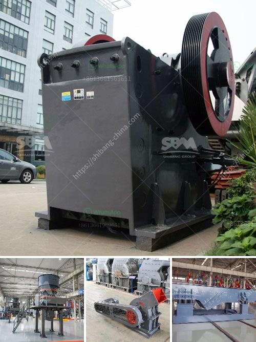

<h3>sand and gravel plant in nepal</h3>
Sand and gravel processing plants play a vital role in the construction industry. They provide essential materials for building roads, homes, and other structures. In Nepal, infrastructure development has been on the rise due to the increasing demand for homes, roads, and bridges. The use of high-quality sand and gravel is necessary for the successful completion of these projects.

A sand and gravel plant in Nepal is a thriving business that requires a strong foundation. A well-designed plant layout and adequate equipment are some of the essential factors that contribute to the success of such a plant. The plant should have a reliable source of raw materials, such as riverbed sand and gravel deposits found in various parts of the country.

One of the significant advantages of having a sand and gravel plant in Nepal is the reduction in transportation costs. Rather than importing these materials from other countries, having a local processing plant ensures a steady supply of sand and gravel at competitive prices. This not only benefits the construction industry but also contributes to the overall economic growth of the country.

The sand and gravel production process involves several stages, including excavation, crushing, screening, washing, and stockpiling. Each step must be carefully executed to ensure the production of high-quality materials. Modern equipment, such as crushers, screens, and washers, play a crucial role in achieving efficient and effective processing.

Moreover, environmental considerations should be a top priority when operating a sand and gravel plant. Extraction of these materials should be done sustainably, without causing any harm to the environment. Proper sediment and runoff management, as well as appropriate disposal of waste materials, are essential to minimize the ecological impact.

In conclusion, the establishment of a sand and gravel plant in Nepal is indispensable for the construction industry. It provides a reliable source of high-quality materials, reduces import dependence, and contributes to economic growth. However, it is crucial to ensure sustainable operations and adhere to environmental standards to protect the natural resources of the country.
<h3>Contact us</h3><ul><li><strong>Whatsapp:&nbsp;<a href="https://wa.me/8613661969651">+8613661969651</a></strong></li><li><a href="https://swt.shibang-china.com/?git&amp;zhl&amp;sand and gravel plant in nepal"><strong>Online Service(chat now)</strong></a></li></ul><h3>Related</h3><ul><li><a href='graphite production line.md'>graphite production line</a></li><li><a href='buy and sell conveyor belts in south africa.md'>buy and sell conveyor belts in south africa</a></li><li><a href='portable portable hammer mill.md'>portable portable hammer mill</a></li><li><a href='diamond screening equipment for sale.md'>diamond screening equipment for sale</a></li><li><a href='crushing machine price in malaysia.md'>crushing machine price in malaysia</a></li></ul>