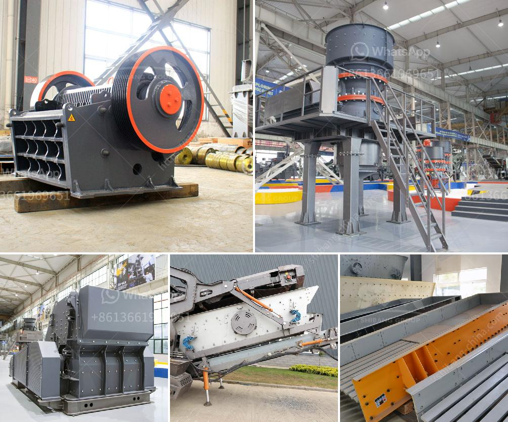

<h3>sand beneficiation plant technology</h3>
Sand beneficiation plant technology is a versatile process that allows the upgrading of low-grade sands through effective removal of impurities, ultimately improving the quality of sand. In this article, we will discuss the different aspects of sand beneficiation plant technology and its potential benefits.

Sand is one of the most widely used natural resources, serving various industries like construction, glass manufacturing, and foundry. However, not all sand is suitable for these applications. The presence of impurities like clay, silt, and organic matter affects the quality and performance of the sand, making it necessary to remove these undesirable particles.

The traditional method of removing impurities from sand is through physical processes like washing and scrubbing. While effective to a certain extent, this method may not be able to completely eliminate all impurities. Moreover, it involves high water consumption, making it unsustainable in water-scarce regions. This is where sand beneficiation plant technology comes into play.

Sand beneficiation plant technology utilizes a combination of hydrocyclones, dewatering screens, spirals, attrition cells, classification tanks, and magnetic separators to achieve the desired quality of sand. By eliminating impurities like clay, silt, and organic matter, the technology enhances the value and usability of the sand.

One of the key advantages of sand beneficiation plant technology is its ability to produce high-quality sand from low-grade materials. This opens up new possibilities for using previously unusable sands, reducing the need for mining fresh resources. This not only conserves natural resources but also reduces environmental impacts associated with mining activities.

Another significant benefit of sand beneficiation plant technology is its efficiency in water conservation. Unlike traditional methods that require excessive water usage, sand beneficiation plant technology operates on a closed-loop system, recycling the water used during the beneficiation process. This greatly minimizes water wastage and makes the technology more sustainable and environmentally friendly.

Moreover, sand beneficiation plant technology can be customized to suit specific requirements. The process can be fine-tuned to treat different types of sands, allowing flexibility in addressing varying impurity levels. Tailor-made solutions ensure maximum efficiency and desired sand qualities for specific applications, meeting industry standards and customer demands.

Sand beneficiation plant technology also offers economic benefits. The upgraded sand has higher demand and value in the market, making it a lucrative investment for sand producers. With increased marketability, sand beneficiation plant technology can contribute to the growth of industries reliant on high-quality sand, such as construction and glass manufacturing.

In conclusion, sand beneficiation plant technology is a game-changing solution for upgrading low-grade sands. With its ability to remove impurities and enhance the quality of sand, it offers numerous benefits such as conservation of natural resources, water efficiency, customization, and economic advantages. As the demand for high-quality sand grows, sand beneficiation plant technology presents a sustainable and economically viable solution for the sand industry.
<h3>Contact us</h3><ul><li><strong>Whatsapp:&nbsp;<a href="https://wa.me/8613661969651">+8613661969651</a></strong></li><li><a href="https://swt.shibang-china.com/?git&amp;zhl&amp;sand beneficiation plant technology"><strong>Online Service(chat now)</strong></a></li></ul><h3>Related</h3><ul><li><a href='pharma grade kaolin process.md'>pharma grade kaolin process</a></li><li><a href='list of iron ore mining companies in china.md'>list of iron ore mining companies in china</a></li><li><a href='jaw crusher engine and complete set.md'>jaw crusher engine and complete set</a></li><li><a href='famous manganese cone crusher parts made in luoyang china.md'>famous manganese cone crusher parts made in luoyang china</a></li><li><a href='limestone crusher equipment.md'>limestone crusher equipment</a></li></ul>