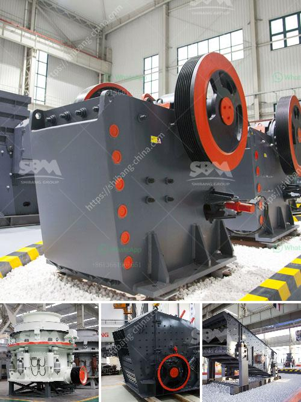

<h3>sand crushing equipment sale in tanzania</h3>
Sand is an essential resource for various construction projects, and its demand has been increasing exponentially in recent years. To meet this growing demand, many countries have ramped up their sand mining activities and have also invested in advanced sand crushing equipment. Tanzania, a country located in East Africa, is one such country that has seen tremendous growth in its construction sector in recent years. Hence, the demand for sand is also high in Tanzania.

Tanzania is blessed with vast coastal areas, making it a haven for sand mining activities. However, with the rise in construction projects, the need for obtaining high-quality sand has become a priority. Traditional sand mining methods were labor-intensive and time-consuming, resulting in lesser production and inconsistencies in the sand quality. To mitigate these challenges, sand crushing equipment has become highly popular in Tanzania.

Sand crushing equipment sale in Tanzania offers a comprehensive range of products and services globally, including construction machines, sewage treatment plants, and tunneling machines. With advanced technology, these products significantly improve the efficiency and productivity of sand crushing, making it a feasible option for many construction projects.

One of the key benefits of sand crushing equipment is its ability to produce a uniform and high-quality product. Unlike traditional sand mining methods, which often result in inconsistent grain size and impurities, sand crushing equipment ensures that the sand is of the desired size and free from any impurities. This is especially crucial for specific construction applications, such as concrete production or sandblasting, where high-quality sand is essential for achieving optimal results.

Furthermore, sand crushing equipment also helps in reducing environmental impacts caused by traditional sand mining. The use of advanced machinery allows for controlled and regulated sand extraction, minimizing damage to the surrounding ecosystem. Additionally, the sand crushing process also helps in removing impurities and harmful substances from the sand, making it more suitable for construction purposes.

Investing in sand crushing equipment in Tanzania not only enhances the quality of sand but also brings several economic benefits. Firstly, it reduces the dependency on imported sand, which can be costly and subject to fluctuations in prices. By producing high-quality sand locally, construction companies can save significantly on transportation costs and ensure a steady supply of sand for their projects.

Secondly, sand crushing equipment creates job opportunities for the local population. As the construction sector grows, so does the demand for skilled workers in operating and maintaining sand crushing machinery. This provides employment opportunities, especially for the youth, contributing to the overall development and economic growth of Tanzania.

To conclude, the sale of sand crushing equipment in Tanzania serves as a significant boost to the construction sector and the entire economy. It offers a sustainable solution for sourcing high-quality sand, reducing environmental impacts, and creating employment opportunities. In order to meet the ever-increasing demand for sand, it is crucial for Tanzania to embrace advanced technology and invest in modern sand crushing equipment. This not only benefits the construction industry but also promotes overall economic growth and development in the country.
<h3>Contact us</h3><ul><li><strong>Whatsapp:&nbsp;<a href="https://wa.me/8613661969651">+8613661969651</a></strong></li><li><a href="https://swt.shibang-china.com/?git&amp;zhl&amp;sand crushing equipment sale in tanzania"><strong>Online Service(chat now)</strong></a></li></ul><h3>Related</h3><ul><li><a href='chrome sands washing plant with prices.md'>chrome sands washing plant with prices</a></li><li><a href='gold mining equipment manufacturer china.md'>gold mining equipment manufacturer china</a></li><li><a href='stone crusher plant in kenya.md'>stone crusher plant in kenya</a></li><li><a href='quarry crushing plants in south africa.md'>quarry crushing plants in south africa</a></li><li><a href='to do with the stone crusher.md'>to do with the stone crusher</a></li></ul>