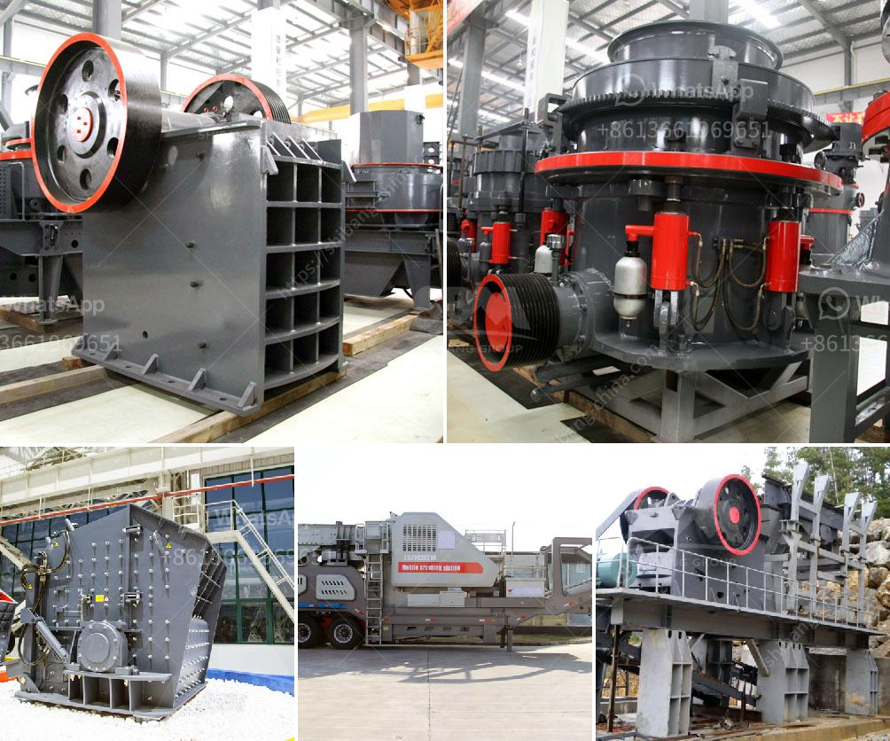

<h3>sand in washing machine</h3>
Sand in the washing machine is a nuisance that many homeowners have to deal with. It can make the washer's tub look dirty, cause clothes to become less clean, and even damage the appliance over time. While it may seem like a minor inconvenience, sand can actually be quite problematic, especially if left unchecked. In this article, we will explore the causes, effects, and some effective solutions to address the issue of sand in the washing machine.

One of the primary reasons why sand ends up in the washing machine is the presence of sandy soil in the surroundings. Whether it's from the beach, nearby construction sites, or even the sand used in children's outdoor play areas, sand often finds its way into the washing machine. Additionally, sand can accumulate in pockets, cuffs, and hems of clothes, which then enters the washing machine during a wash cycle.

The presence of sand in the washing machine can lead to several issues. Firstly, it makes the washing tub appear dirty, giving the impression that clothes are not getting adequately cleaned. This can be especially frustrating for individuals who strive for immaculate cleanliness in their laundry. Secondly, sand can cause clothes to become less clean as it sticks to fabric fibers, leading to a lack of freshness and potentially unpleasant odors. Lastly, if sand continually builds up over time, it can affect the washing machine's performance and even damage its components.

So, what can be done to address this persistent problem? Fortunately, there are a few effective strategies to reduce the presence of sand in the washing machine. The first step is to shake off any excess sand from clothes, towels, or other items before placing them in the machine. A gentle shake outdoors or over a dustbin will efficiently remove loose sand particles.

Another useful tip is to use a lint trap or a laundry bag specifically designed to catch dirt and debris. These accessories can be placed inside the washing machine to filter out sand, preventing it from entering the machine's mechanisms. Additionally, using a laundry bag can protect delicate fabrics from potential damage caused by sand abrasion.

Regular maintenance is crucial to ensuring the longevity of your washing machine. Cleaning the machine after every wash, particularly around the rubber seal and detergent dispenser, will prevent sand from accumulating and causing blockages. To clean the washing machine's tub, run an empty cycle with hot water and a mixture of vinegar and baking soda. This combination effectively removes any residual sand, dirt, and odors, leaving the machine fresh and ready for the next load.

In conclusion, while sand in the washing machine may seem like a minor annoyance, it can have significant consequences over time. From dirty-looking clothes to potential damage to the machine, sand can cause various issues. Preventive measures, such as shaking off excess sand, using lint traps or laundry bags, and regular maintenance, can effectively address this problem. By implementing these solutions, homeowners can ensure a cleaner, fresher, and more efficient washing machine, free from the hassle of sand.
<h3>Contact us</h3><ul><li><strong>Whatsapp:&nbsp;<a href="https://wa.me/8613661969651">+8613661969651</a></strong></li><li><a href="https://swt.shibang-china.com/?git&amp;zhl&amp;sand in washing machine"><strong>Online Service(chat now)</strong></a></li></ul><h3>Related</h3><ul><li><a href='limestone grinding machine bangladesh.md'>limestone grinding machine bangladesh</a></li><li><a href='cost of mini pulvrizers crusher.md'>cost of mini pulvrizers crusher</a></li><li><a href='iron ore processing equipment.md'>iron ore processing equipment</a></li><li><a href='powder making machines.md'>powder making machines</a></li><li><a href='cement grinding plant layout.md'>cement grinding plant layout</a></li></ul>