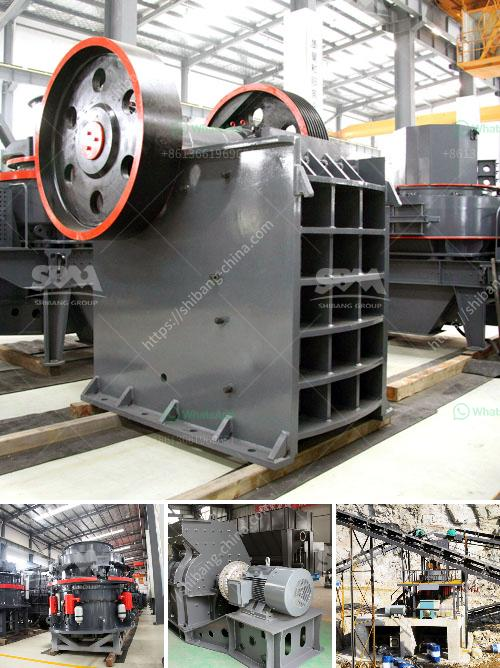

<h3>sand making machine cost</h3>
The cost of sand making machines is an important factor that clients should consider before making a purchase. However, it is also important to note that certain factors may affect the cost of these machines. This article will explore the factors that influence the cost of sand making machines and provide insights into finding the most cost-effective option.

One of the main factors that affect the cost of sand making machines is the technical configuration. Different machines come with different specifications and functionalities, thus varying in price. The more advanced and efficient the machine is, the higher the cost will be. Additionally, the capacity or production capability of the machine is another key factor. Machines with larger capacities tend to cost more due to the increased power and materials required for their production.

Another factor that impacts the cost is the quality of materials used. Sand making machines are typically made of high-quality materials such as steel and alloy, which contributes to their durability and performance. Machines constructed with better materials tend to incur higher production costs, resulting in a higher selling price.

Furthermore, the brand and reputation of the manufacturer also play a significant role in the cost of sand making machines. Well-established and reputable manufacturers often charge higher prices for their machines due to their brand value and the trust they have built with customers over the years. While these machines may come at a higher cost, they are usually more reliable and durable.

In addition to the initial purchase cost, it is essential to consider the long-term operating costs of sand making machines. Energy consumption is a significant expense in operating these machines, so investing in energy-efficient models can result in substantial savings over time. Regular maintenance and spare parts availability should also be taken into account, as machines requiring frequent repairs or with limited availability of spare parts may end up costing more in the long run.

To find the most cost-effective sand making machine, clients should carefully assess their specific needs and budget. It is recommended to compare different manufacturers and models, taking into consideration their technical configuration, quality of materials, and reputation. Reading customer reviews and seeking recommendations from industry professionals can provide valuable insights into the performance and reliability of different machines.

Moreover, clients can consult multiple vendors and request detailed quotations that include all associated costs, such as transportation, installation, and after-sales services. This will help in making an informed decision and ensure there are no hidden costs later on.

In conclusion, the cost of sand making machines depends on various factors, such as technical configuration, quality of materials, brand reputation, and long-term operating costs. Clients should consider their specific requirements and budget to find the most cost-effective option. Thorough research, comparison, and consultation are essential steps to ensure a wise investment in sand making machines.
<h3>Contact us</h3><ul><li><strong>Whatsapp:&nbsp;<a href="https://wa.me/8613661969651">+8613661969651</a></strong></li><li><a href="https://swt.shibang-china.com/?git&amp;zhl&amp;sand making machine cost"><strong>Online Service(chat now)</strong></a></li></ul><h3>Related</h3><ul><li><a href='complete plant copper extraction processing for sale.md'>complete plant copper extraction processing for sale</a></li><li><a href='ball mill for grinding of soda feldspar.md'>ball mill for grinding of soda feldspar</a></li><li><a href='india edible clay making process.md'>india edible clay making process</a></li><li><a href='roll mill machine manufacturers.md'>roll mill machine manufacturers</a></li><li><a href='list of cement plants and their capacities.md'>list of cement plants and their capacities</a></li></ul>