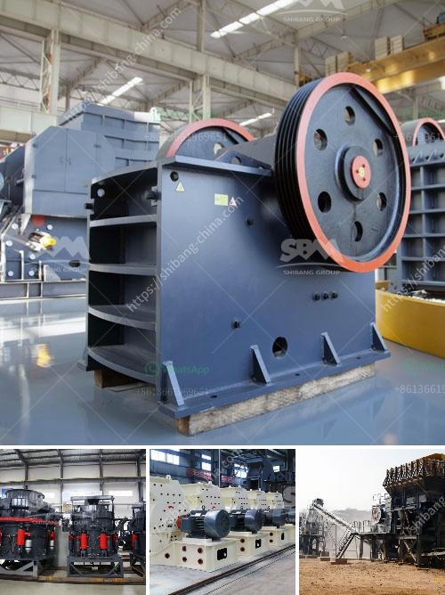

<h3>sand making machine price</h3>
A sand making machine is used to produce sand by crushing rocks, stones, and other materials. It is widely used in the construction industry to create sand and gravel material for various projects. The demand for sand making machines is increasing due to the growth of the construction industry worldwide.

When it comes to buying a sand making machine, price is a crucial factor to consider. The price range of sand making machines varies depending on their size, functionality, and capacity. Typically, smaller sand making machines come at a lower price range, while larger and more powerful machines are significantly more expensive.

On average, the price of a sand making machine can range from $3,000 to $20,000. However, more advanced models with higher capacities can cost up to $50,000 or more. It is essential to analyze your requirements and budget before making a purchase decision.

Several factors contribute to the pricing of sand making machines. Firstly, the brand and reputation of the manufacturer play a significant role. Well-established brands often have higher prices due to their expertise, quality, and reliability. However, there are also lesser-known brands that offer good quality machines at more affordable prices.

Additionally, the type of sand making machine also affects the price. There are several types available, including vertical shaft impact crushers, cone crushers, and hammer crushers. Each type has its own set of features and benefits, and the prices may vary accordingly.

It is vital to find the right balance between price and quality when buying a sand making machine. Cheaper options may compromise on durability and performance, so it is crucial to thoroughly research and compare different models and manufacturers. Reading customer reviews and seeking recommendations from industry experts can help in making an informed decision.

In conclusion, the price of a sand making machine can vary significantly depending on various factors. It is essential to consider your requirements, budget, and the reputation of the manufacturer. By doing thorough research and comparing different options, you can find a sand making machine that fits your needs and offers an optimal balance between price and quality.
<h3>Contact us</h3><ul><li><strong>Whatsapp:&nbsp;<a href="https://wa.me/8613661969651">+8613661969651</a></strong></li><li><a href="https://swt.shibang-china.com/?git&amp;zhl&amp;sand making machine price"><strong>Online Service(chat now)</strong></a></li></ul><h3>Related</h3><ul><li><a href='crusher sand and stone in kenya.md'>crusher sand and stone in kenya</a></li><li><a href='processing of limestone and crushing.md'>processing of limestone and crushing</a></li><li><a href='10 tph trally mounted stone crusher made in india.md'>10 tph trally mounted stone crusher made in india</a></li><li><a href='grinding machines for clay.md'>grinding machines for clay</a></li><li><a href='rock crusher in europe.md'>rock crusher in europe</a></li></ul>