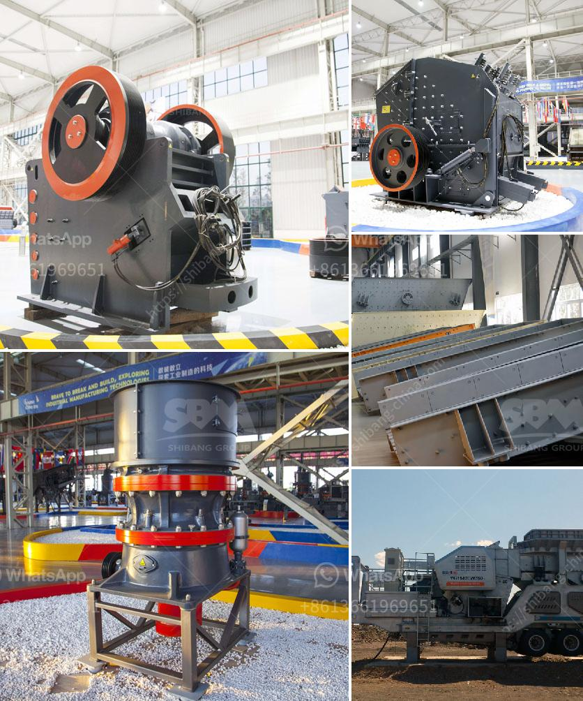

<h3>sand making machine suppliers in south africa</h3>
Sand making machine suppliers in South Africa are one of the best resources for construction materials in the country. With the global economic downturn, manufacturers are looking for ways to cut costs and stay competitive. Sand making machines, also known as vertical shaft impactors, are the ideal equipment for producing sand. They offer high efficiency and low operating costs, making them the preferred choice for many construction companies.

South Africa is home to some of the largest mining operations in the world. The country has abundant deposits of various minerals, including gold, platinum, and diamonds. These mining operations generate tons of waste material, including rocks and stones. Sand making machines can crush this waste material into usable sand, which can then be sold to construction companies or used for other purposes.

One of the leading sand making machine suppliers in South Africa is Cape Silica Suppliers. They manufacture and supply various grades of sand, including building sand, plastering sand, and filling sand. Their sand making machine is sold directly to customers, without any intermediary involvement. This cuts costs and ensures that customers receive the best possible prices.

Another prominent sand making machine supplier is VSI5X Sand Maker. This company manufactures and supplies high-quality sand making machines that meet international standards. Their machines are known for their durability and reliability, making them ideal for heavy-duty applications. VSI5X Sand Maker also offers excellent after-sales service and technical support, ensuring that customers receive prompt assistance whenever required.

Other sand making machine suppliers in South Africa include Stone Crusher Sand, Vacor, and various reputable construction companies. The process of sand making involves three stages: coarse crushing, medium crushing, and fine crushing. These stages are performed by a variety of equipment, including jaw crushers, impact crushers, cone crushers, vibrating screens, and sand washers.

Sand making machines can produce sand in various sizes, depending on the requirements of the construction project. The final product can be used in a range of applications, including concrete production, road construction, and landscaping. The sand produced by these machines is consistent in quality and free from impurities, making it highly desirable for construction projects.

In conclusion, sand making machine suppliers in South Africa are crucial to the construction industry. These machines enable the efficient production of sand from waste materials, reducing costs and ensuring a consistent supply of high-quality sand. Companies like Cape Silica Suppliers and VSI5X Sand Maker offer top-of-the-line machines that meet international standards. With their support and expertise, the construction industry in South Africa can continue to thrive and meet the demands of a growing economy.
<h3>Contact us</h3><ul><li><strong>Whatsapp:&nbsp;<a href="https://wa.me/8613661969651">+8613661969651</a></strong></li><li><a href="https://swt.shibang-china.com/?git&amp;zhl&amp;sand making machine suppliers in south africa"><strong>Online Service(chat now)</strong></a></li></ul><h3>Related</h3><ul><li><a href='japan made jaw crushers.md'>japan made jaw crushers</a></li><li><a href='dolomite production process.md'>dolomite production process</a></li><li><a href='diesel engine stone crusher small for quarry project.md'>diesel engine stone crusher small for quarry project</a></li><li><a href='crushing machine price in malaysia.md'>crushing machine price in malaysia</a></li><li><a href='sand in washing machine.md'>sand in washing machine</a></li></ul>