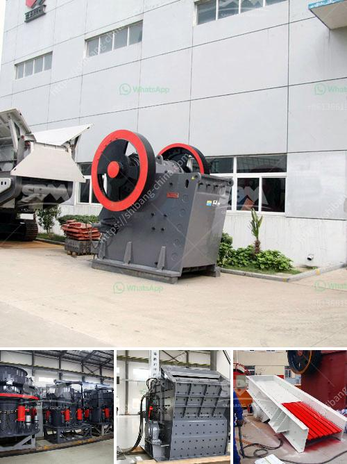

<h3>sand screener and washer</h3>
A sand screener and washer is a useful tool in the construction industry for cleaning and separating sand particles. With the increase in demand for high-quality sand for various applications, such as concrete production and sandblasting, the need for efficient sand screening and washing equipment has become crucial.

The main function of a sand screener and washer is to remove impurities and foreign particles from the sand, ensuring that only clean and graded fine sand is produced. This is achieved through a series of processes, starting with the feeding of raw sand into the machine. The sand is then screened, separating larger particles and debris from the finer grains.

Once the screening process is completed, the clean sand is conveyed to the washer section, where water is used to remove any remaining impurities. The water flow and the rotational motion of the washer facilitate the removal of fine dust, clay, and other contaminants. This ensures that the final product is of high quality, free from any unwanted substances that could affect its performance in construction applications.

A sand screener and washer offers several benefits to construction companies. Firstly, it improves the quality of sand, enhancing its usability and performance in various projects. Moreover, by removing impurities, it helps to minimize the risk of damage to construction equipment, such as pumps and concrete mixers, which could be clogged or damaged by particles in the sand.

Furthermore, a sand screener and washer is highly efficient, enabling a faster production process. By automating the screening and washing tasks, it reduces the need for manual labor, saving time and resources for construction companies. Additionally, the compact design of modern sand screening and washing machines allows for easy transportation and installation, making them a flexible and cost-effective solution for different construction sites.

In conclusion, a sand screener and washer is an invaluable tool in the construction industry, helping to produce clean and high-quality sand for various applications. It offers efficient screening and washing processes, removing impurities and foreign particles from the sand. With its numerous benefits, including improved sand quality, reduced equipment damage, and increased production efficiency, a sand screener and washer is an essential investment for any construction company aiming for excellence in their projects.
<h3>Contact us</h3><ul><li><strong>Whatsapp:&nbsp;<a href="https://wa.me/8613661969651">+8613661969651</a></strong></li><li><a href="https://swt.shibang-china.com/?git&amp;zhl&amp;sand screener and washer"><strong>Online Service(chat now)</strong></a></li></ul><h3>Related</h3><ul><li><a href='calcining machine for gypsum factory from taiwan.md'>calcining machine for gypsum factory from taiwan</a></li><li><a href='equipment needed for quarry crusher.md'>equipment needed for quarry crusher</a></li><li><a href='stone crusher for sale in south korea.md'>stone crusher for sale in south korea</a></li><li><a href='start a quarry plant.md'>start a quarry plant</a></li><li><a href='coal screening plant in morbi.md'>coal screening plant in morbi</a></li></ul>