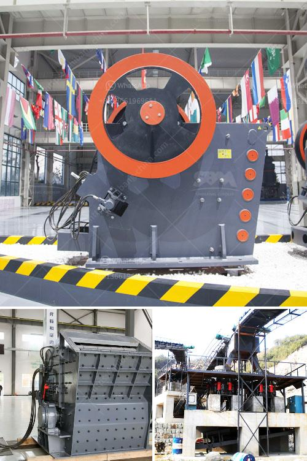

<h3>sand screening machine philippines</h3>
Sand materials are integral in the construction industry, with countless projects depending on the quality and consistency of the sand used. The demand for sand in the Philippines, with its booming construction sector, has led to the development of innovative tools and equipment to enhance the efficiency of sand screening and processing. Among these is the sand screening machine, a crucial equipment in the sand production process.

The sand screening machine in the Philippines is highly efficient in separating unwanted materials from the sand mixture. Whether it be removing impurities such as dust, rocks, and debris, or unwanted particles such as bits of plastic or metal, the sand screening machine has the capability of performing these tasks with ease. These machines are commonly used in various sectors such as mining, construction, and agriculture, making them essential equipment for any sand-related project.

One of the main benefits of using a sand screening machine is its ability to save time and labor. Traditional sand sifting methods involve manual labor, which often leads to inconsistencies in the quality of the sand mix. With the use of a sand screening machine, the process becomes automated and efficient, reducing the need for manual labor and ensuring a more consistent sand mixture.

Another advantage of the sand screening machine is its versatility. These machines come in various sizes and configurations, allowing them to be used for different purposes. Some machines are specifically designed for small-scale projects, while others are capable of handling larger volumes. Additionally, the machines can be easily transported to different sites, making them ideal for on-site screening.

Apart from saving time and labor, sand screening machines also contribute to environmental preservation. By removing unwanted materials and impurities from the sand mixture, these machines ensure that only clean and high-quality sand is used in construction projects. This leads to better construction outcomes and reduces the need for additional sand mining, which can have detrimental effects on the environment.

In the Philippines, the demand for sand continues to rise, especially with the increasing number of infrastructure projects in major cities. As a result, the availability of high-quality sand becomes more crucial. The sand screening machine plays a significant role in meeting this demand by ensuring that only the best sand materials are utilized in construction projects.

In conclusion, the sand screening machine in the Philippines is an essential equipment in the sand production process. It helps remove unwanted materials and impurities from the sand mixture, saving time and labor, ensuring a more consistent sand mix, and contributing to environmental preservation. With the continuous development and improvement of sand screening machines, the construction industry in the Philippines can expect more efficient and sustainable sand production processes in the future.
<h3>Contact us</h3><ul><li><strong>Whatsapp:&nbsp;<a href="https://wa.me/8613661969651">+8613661969651</a></strong></li><li><a href="https://swt.shibang-china.com/?git&amp;zhl&amp;sand screening machine philippines"><strong>Online Service(chat now)</strong></a></li></ul><h3>Related</h3><ul><li><a href='kaolin clay crusher manufacturing process.md'>kaolin clay crusher manufacturing process</a></li><li><a href='hard rock quarry cursher in libya.md'>hard rock quarry cursher in libya</a></li><li><a href='quarry crushing plants in south africa.md'>quarry crushing plants in south africa</a></li><li><a href='crusher plant layout.md'>crusher plant layout</a></li><li><a href='stone crusher hammer mill.md'>stone crusher hammer mill</a></li></ul>