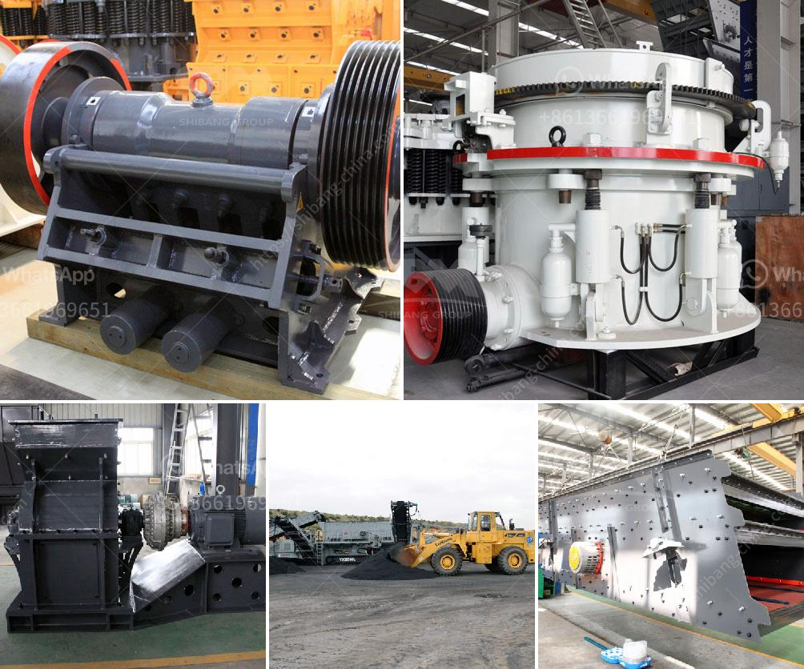

<h3>sand washing machine in saudi arabia</h3>
Sand washing machine is widely used in construction sites, gravel plants, concrete hydropower dam sites, and other industries. It has the advantages of low power consumption, high cleanliness, and low water consumption. It is currently the most efficient sand washing equipment in Saudi Arabia.

The sand washing machine is a kind of sand washing equipment used for sand (artificial sand, natural sand), which can make the sand cleaner and higher quality. It is widely used in sand quarries, mines, building materials, transportation, chemicals, water conservancy Concrete mixing station, and other industries. At present, there are various types of sand washing machines on the market, and the quality of the sand washing equipment produced in different regions is different. In order to ensure that the purchased sand washing equipment can handle the sand washing requirements of the construction site, we must pay attention to the following points when purchasing:

Firstly, we need to understand the production capacity of the sand washing machine. The production capacity refers to the amount of sand that can be processed by the sand washing machine within a certain period of time. The production capacity of different sand washing machines is different, so we need to choose the sand washing machine according to the actual production needs of our construction site.

Secondly, we need to consider the water consumption of the sand washing machine. In Saudi Arabia, water resources are scarce and expensive. Therefore, when choosing a sand washing machine, we should choose a model with low water consumption to avoid wasting water resources and increase operating costs.

Thirdly, we need to pay attention to the energy consumption of the sand washing machine. High-energy consumption will increase the operating cost of the sand washing machine. Therefore, when choosing a sand washing machine, we should choose a model with low power consumption, which can save electricity costs to a certain extent.

Fourthly, we need to pay attention to the after-sales service of the sand washing machine manufacturer. Timely and professional after-sales service can effectively solve the problems encountered during use and ensure the normal operation of the sand washing machine in the later period. Therefore, when choosing a sand washing machine, we should choose a manufacturer with good after-sales service reputation, which will bring more convenience to our future use.

In summary, the sand washing machine is an essential equipment for sand production line. It can effectively remove dirt and impurities from sand, improve sand quality, and ensure the cleanliness of sand aggregates. When purchasing, we should consider factors such as production capacity, water consumption, energy consumption, and after-sales service, so as to choose a sand washing machine that meets our actual needs.
<h3>Contact us</h3><ul><li><strong>Whatsapp:&nbsp;<a href="https://wa.me/8613661969651">+8613661969651</a></strong></li><li><a href="https://swt.shibang-china.com/?git&amp;zhl&amp;sand washing machine in saudi arabia"><strong>Online Service(chat now)</strong></a></li></ul><h3>Related</h3><ul><li><a href='used granite crusher machinery.md'>used granite crusher machinery</a></li><li><a href='equipment costs for cement plant.md'>equipment costs for cement plant</a></li><li><a href='rock crusher road construction.md'>rock crusher road construction</a></li><li><a href='100tph stationery stone crushing plant.md'>100tph stationery stone crushing plant</a></li><li><a href='vertical roller mill coal.md'>vertical roller mill coal</a></li></ul>