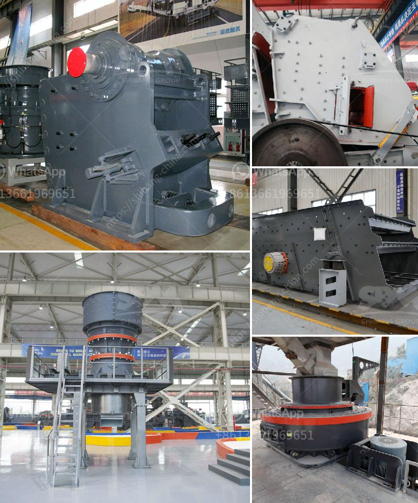

<h3>sand washing machines turkey</h3>
Sand washing machines, also known as spiral stone washing machines, are mainly used to remove impurities (such as dust) from sand products. Because more washing methods are used, it can produce better sand washing effect. The equipment has been comprehensively upgraded through multiple upgrades, improving the work efficiency and stability of the machine.

Turkey is one of the most developed countries in the Middle East. Its construction industry is growing rapidly, leading to an increasing demand for sand and aggregate materials. Therefore, sand washing machines have become essential equipment in the Turkish construction industry.

Sand washing machines in Turkey mainly include bucket wheel sand washers and spiral sand washers. The former mainly relies on the impeller to rotate and stir the sand and gravel materials to remove impurities and clean the sand. The latter uses the spiral blades on the screw shaft to stir the sand and gravel materials during the rotation process, so as to achieve the purpose of cleaning and classification of the materials.

Compared with traditional sand washing equipment, sand washing machines in Turkey have the advantages of high production capacity, low energy consumption, better cleanliness of washed sand, and lower maintenance costs. They are widely used in various industries, such as sand and gravel plants, mines, building materials, transportation, chemical industry, water conservancy and hydropower, concrete mixing plants, etc.

In recent years, with the increasing demand for sand and aggregates, Turkish manufacturers have continuously improved and innovated sand washing machines. They have introduced advanced technology and equipment from abroad to make the machines more efficient and environmentally friendly.

One of the leading manufacturers of sand washing machines in Turkey is Ciftel Machine. With more than 30 years of experience in the field, Ciftel Machine has developed a series of sand washing equipment with high efficiency and excellent performance. Their machines are not only widely used in Turkey, but also exported to many countries around the world, receiving high praise from customers.

In addition to Ciftel Machine, there are also other reputable manufacturers in Turkey, such as STM Construction Equipment, Fabo Machinery, and Constmach. These manufacturers provide a variety of sand washing machines to meet different customer needs.

In conclusion, sand washing machines in Turkey play a crucial role in the construction industry. With their advanced technology and reliable performance, they have become essential equipment for sand and aggregate production. As the demand for sand and aggregates continues to grow, it is expected that the market for sand washing machines in Turkey will continue to thrive in the future.
<h3>Contact us</h3><ul><li><strong>Whatsapp:&nbsp;<a href="https://wa.me/8613661969651">+8613661969651</a></strong></li><li><a href="https://swt.shibang-china.com/?git&amp;zhl&amp;sand washing machines turkey"><strong>Online Service(chat now)</strong></a></li></ul><h3>Related</h3><ul><li><a href='calcite manufacturing.md'>calcite manufacturing</a></li><li><a href='jaw crusher 400 600.md'>jaw crusher 400 600</a></li><li><a href='companies companies in charge of vibrating screens.md'>companies companies in charge of vibrating screens</a></li><li><a href='50 tpd cement plant manufacturer in china.md'>50 tpd cement plant manufacturer in china</a></li><li><a href='stone quarries in uganda.md'>stone quarries in uganda</a></li></ul>