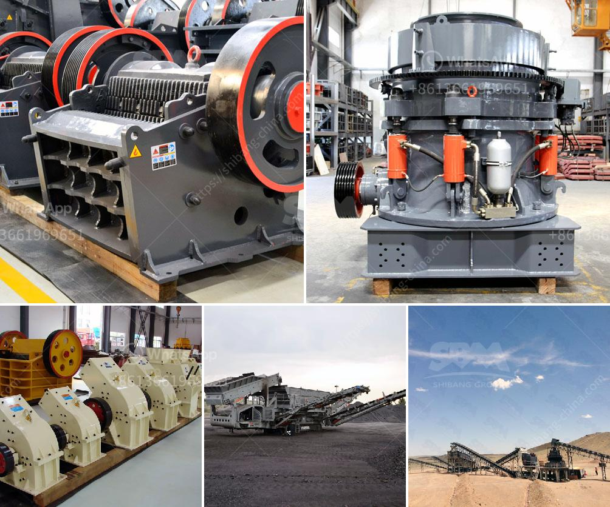

<h3>sand washing plants</h3>
Sand washing plants are used to remove impurities such as dust, silt, and other unwanted particles from sand in order to produce high-quality construction sand. The use of a sand washing plant has become a popular choice for various industries due to its many benefits.

One of the main advantages of a sand washing plant is its ability to clean and refine the sand particles, leaving them in a better condition than before. This is particularly important for industries such as concrete production, where the cleanliness of the sand is crucial for achieving optimal results. By removing impurities, the sand washing plant ensures that the resulting sand is of high quality and suitable for use in construction projects.

In addition to improving the quality of the sand, a sand washing plant also helps to conserve water. Water is a valuable resource, and its scarcity in many parts of the world has led to an increased emphasis on water conservation. A sand washing plant uses water to wash and clean the sand, but it does so in a way that minimizes water wastage. The water used in the washing process is recycled and reused, reducing the overall water consumption of the plant. This not only helps to conserve water but also reduces the operating costs of the plant.

Another benefit of using a sand washing plant is the reduction in the environmental impact. Sand extraction can cause significant damage to the environment, particularly when done on a large scale. It can lead to erosion, loss of vegetation, and disruption of habitats for various species. By using a sand washing plant, the amount of sand that needs to be extracted from natural sources can be significantly reduced. This helps to preserve natural ecosystems, protect wildlife, and minimize the overall environmental impact.

Furthermore, a sand washing plant has a positive impact on the economy. The production of high-quality sand is in high demand for various construction projects. By investing in a sand washing plant, companies can ensure a steady supply of clean sand, which can be sold to construction companies at a profit. This not only contributes to the growth of the company but also creates job opportunities for individuals involved in the operation and maintenance of the plant.

In conclusion, sand washing plants offer numerous benefits for various industries. They improve the quality of sand, conserve water, reduce environmental impact, and contribute to the economy. With the growing emphasis on sustainability and environmental responsibility, investing in a sand washing plant is a wise decision for any company involved in sand production. It not only ensures the production of high-quality sand but also demonstrates a commitment to sustainable practices.
<h3>Contact us</h3><ul><li><strong>Whatsapp:&nbsp;<a href="https://wa.me/8613661969651">+8613661969651</a></strong></li><li><a href="https://swt.shibang-china.com/?git&amp;zhl&amp;sand washing plants"><strong>Online Service(chat now)</strong></a></li></ul><h3>Related</h3><ul><li><a href='calcite grinding machine manufacturer in udaipur.md'>calcite grinding machine manufacturer in udaipur</a></li><li><a href='diamond stone crusher.md'>diamond stone crusher</a></li><li><a href='gypsum calcining equipment price.md'>gypsum calcining equipment price</a></li><li><a href='raymond grinding mill manufacturers india.md'>raymond grinding mill manufacturers india</a></li><li><a href='stone cracker machines.md'>stone cracker machines</a></li></ul>