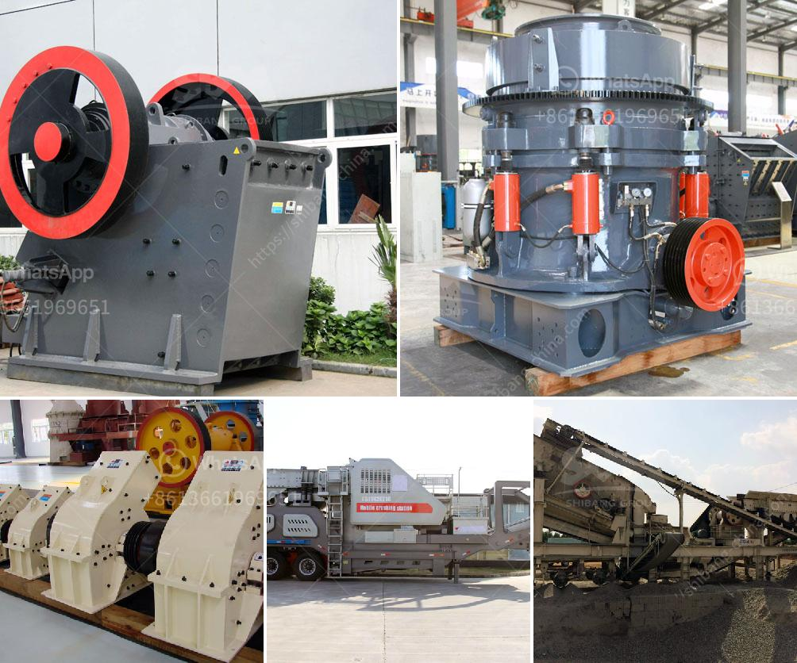

<h3>sand washing screener florida</h3>
In the construction industry, the quality of materials used plays a pivotal role in determining the success of any project. One such material that is widely used is sand. Whether it is for creating concrete, plastering walls, or filling in gaps, sand forms an integral part of various construction projects. However, before this crucial material can be utilized, it needs to be thoroughly cleaned and graded. This is where a sand washing screener comes into play, especially in the state of Florida, where the demand for construction is ever-growing.

The sand washing screener Florida is a state-of-the-art equipment designed specifically for cleaning and grading sand. It is equipped with a series of screens or meshes that separate the sand particles based on their size. By removing impurities and ensuring uniformity, the sand washing screener produces high-quality sand that meets the specifications required for construction purposes.

One of the main advantages of using a sand washing screener Florida is that it significantly improves the quality of the sand. In its natural form, sand can contain various impurities such as clay, silt, and debris. These impurities can negatively impact the strength and durability of concrete and other construction materials. Through the process of washing and screening, the sand washing screener removes these impurities, resulting in cleaner and purer sand.

Moreover, the sand washing screener Florida is also efficient in grading the sand particles according to their size. Different construction projects require sand with specific particle sizes, such as fine or coarse sand. The sand washing screener can easily separate the sand particles based on their size, ensuring that the right grade of sand is used for each project.

Another significant advantage of using a sand washing screener Florida is its contribution to environmental conservation. Construction projects often generate a considerable amount of waste, including contaminated sand. Instead of disposing of this waste, the sand washing screener can effectively clean and recycle the sand, reducing the need for new sand extraction. This not only minimizes the environmental impact of construction activities but also helps in conserving natural resources.

The versatility of the sand washing screener Florida is another reason why it is widely used in the construction industry. It can be easily integrated into existing sand processing systems, making it a valuable addition to construction sites. The equipment is also designed to be easily transportable, allowing it to be deployed to different project locations as needed.

In conclusion, the sand washing screener Florida has become an essential equipment in the construction industry. It plays a crucial role in cleaning, grading, and recycling sand, ensuring that only high-quality sand is used in construction projects. With its ability to remove impurities, improve sand quality, and contribute to environmental conservation, the sand washing screener is a valuable asset for any construction company operating in Florida. By investing in this advanced equipment, construction projects can be completed with greater efficiency, durability, and sustainability.
<h3>Contact us</h3><ul><li><strong>Whatsapp:&nbsp;<a href="https://wa.me/8613661969651">+8613661969651</a></strong></li><li><a href="https://swt.shibang-china.com/?git&amp;zhl&amp;sand washing screener florida"><strong>Online Service(chat now)</strong></a></li></ul><h3>Related</h3><ul><li><a href='crushers rock crushers and minerals.md'>crushers rock crushers and minerals</a></li><li><a href='advantage and disadvantage of jaw crusher.md'>advantage and disadvantage of jaw crusher</a></li><li><a href='material ball mills.md'>material ball mills</a></li><li><a href='supplier of gold desorption plant in china.md'>supplier of gold desorption plant in china</a></li><li><a href='rock crushing machine for sale.md'>rock crushing machine for sale</a></li></ul>