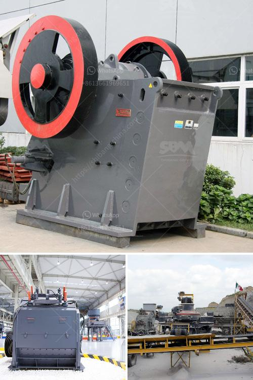

<h3>sandstone crusher quarry</h3>
Sandstone is a natural stone that is formed from sand grains bonded together through pressure and cementation. It is a highly popular building material due to its durability, aesthetic appeal, and versatility. One of the key steps in the process of extracting sandstone from the ground is the use of a crusher quarry.

A crusher quarry refers to the dedicated site where the blasting and crushing of large stones into smaller chunks of manageable sizes take place. The materials extracted from the quarry are vital for various construction projects, including road construction, building foundations, and railway tracks.

The process of quarrying sandstone starts with the removal of the topsoil, which is usually done with the help of heavy machinery and equipment. Once the topsoil is removed, the next step involves the drilling of holes into the rock formation. These holes are then filled with explosives, which are detonated to break the rock into manageable pieces.

The broken rock is then loaded onto trucks or conveyor belts and transported to the crusher quarry for further processing. At the quarry, the large chunks of sandstone are fed into the crusher, which gradually breaks them down into smaller pieces. The resulting crushed sandstone is then screened to separate the various sizes of particles.

The crusher quarry usually consists of multiple crushers, each designed for specific applications. For instance, jaw crushers are typically used for primary crushing, while impact crushers are used for secondary crushing. Cone crushers, on the other hand, are used in the final stage of the crushing process to produce smaller-sized aggregate.

Crushing sandstone at the quarry is a complex process that requires careful planning, precise engineering, and high-quality equipment. Ultimately, the goal is to produce sandstone that meets the specific requirements of the project. This includes not only the desired particle size but also the desired shape, cleanliness, and gradation.

The quality of the sandstone produced at the quarry depends on several factors, including the type and quality of the rock, the crushing process used, and the expertise of the quarry operators. It is imperative for the operators to carefully monitor and control the entire production process to ensure consistent and high-quality output.

In conclusion, a sandstone crusher quarry plays a crucial role in the production of high-quality sandstone for various construction projects. The process of quarrying sandstone involves extraction, crushing, and screening of the rock to obtain the desired sizes and quality. The quarry operators must employ the right equipment, techniques, and expertise to ensure the production of high-quality sandstone that meets the specifications of the project.
<h3>Contact us</h3><ul><li><strong>Whatsapp:&nbsp;<a href="https://wa.me/8613661969651">+8613661969651</a></strong></li><li><a href="https://swt.shibang-china.com/?git&amp;zhl&amp;sandstone crusher quarry"><strong>Online Service(chat now)</strong></a></li></ul><h3>Related</h3><ul><li><a href='conveyor belt seller in philippines.md'>conveyor belt seller in philippines</a></li><li><a href='black stone crushing nigeria.md'>black stone crushing nigeria</a></li><li><a href='impact crusher company.md'>impact crusher company</a></li><li><a href='gypsum board plant initial investment.md'>gypsum board plant initial investment</a></li><li><a href='18tph roll mill process.md'>18tph roll mill process</a></li></ul>