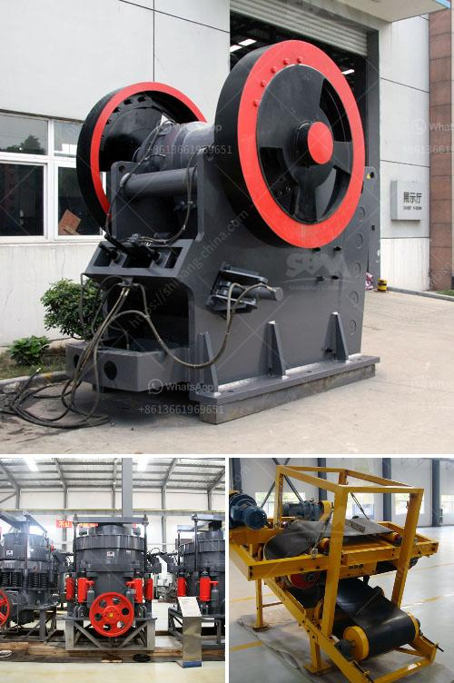

<h3>scale gold mining equipment in south africa</h3>
In recent years, small-scale gold mining has gained more prominence as a lucrative and potentially life-changing endeavor for many individuals in South Africa. With limited job opportunities available, especially for those in rural areas, small-scale gold mining provides an avenue for employment and economic growth. However, it is crucial to recognize the challenges that come with this industry and the essential equipment needed to ensure safe and sustainable operations.

Small-scale gold mining in South Africa refers to the mining of gold by individuals or small groups using rudimentary techniques and equipment. These small-scale miners often work on a semi-illegal or illegal basis, as access to mining permits and licenses is limited due to various reasons, including a lack of resources or failure to comply with regulations.

While small-scale gold mining can be an important economic lifeline for many communities, it is imperative to ensure the safety and well-being of the miners and the environment. Investing in appropriate and efficient equipment is essential to achieving these goals.

One of the most critical pieces of equipment utilized in small-scale gold mining is the trommel. A trommel is a cylindrical drum with a series of screens through which materials are sorted. It is used to extract gold from gravel, clay, and sand, separating the valuable mineral from the waste material. Trommels are available in various sizes and capacities, enabling miners to process different volumes of material efficiently.

Another commonly used piece of equipment in small-scale gold mining is the sluice box. A sluice box is a long, narrow channel with riffles or mats on the bottom, allowing the flow of water to wash away lighter materials while capturing heavier particles, including gold. Sluice boxes come in different sizes and configurations, ensuring flexibility for miners working with different ore types and volumes.

Complementary to the trommel and sluice box, a gold pan is a simple and affordable tool for separating gold from sediment. Miners use gold pans to manually wash and concentrate material, allowing them to identify and extract gold particles. Gold pans can be easily carried, making them a vital tool for prospecting new areas and evaluating potential mining sites.

Safety equipment should not be overlooked in small-scale gold mining operations to protect miners from potential hazards. Miners should have access to personal protective equipment (PPE) such as helmets, gloves, and masks to prevent injuries and minimize health risks. Additionally, proper ventilation and lighting systems are crucial for underground mining operations, ensuring a safe working environment.

It is important to note that investing in the right equipment is just one piece of the puzzle. Access to financing, training, and technical support is crucial to enabling small-scale miners to operate efficiently and sustainably. Governments and relevant stakeholders should work together to provide assistance in these areas, ensuring that small-scale gold mining contributes to local development while minimizing negative environmental and social impacts.

In conclusion, small-scale gold mining in South Africa has the potential to uplift communities by providing employment opportunities and contributing to local economies. However, it is essential to invest in appropriate equipment to ensure safety and sustainability. Trommels, sluice boxes, and gold pans are critical tools for extracting gold, while safety equipment protects miners from potential hazards. With the right equipment and support systems in place, small-scale gold mining can become a viable and responsible industry, benefiting both the individuals involved and the larger society.
<h3>Contact us</h3><ul><li><strong>Whatsapp:&nbsp;<a href="https://wa.me/8613661969651">+8613661969651</a></strong></li><li><a href="https://swt.shibang-china.com/?git&amp;zhl&amp;scale gold mining equipment in south africa"><strong>Online Service(chat now)</strong></a></li></ul><h3>Related</h3><ul><li><a href='jaw crusher plant price.md'>jaw crusher plant price</a></li><li><a href='overland conveyor cost calculator.md'>overland conveyor cost calculator</a></li><li><a href='grinding mill grinding machine grinders grinning mill.md'>grinding mill grinding machine grinders grinning mill</a></li><li><a href='grinding machine manufacturers from europe.md'>grinding machine manufacturers from europe</a></li><li><a href='coal washing machines.md'>coal washing machines</a></li></ul>