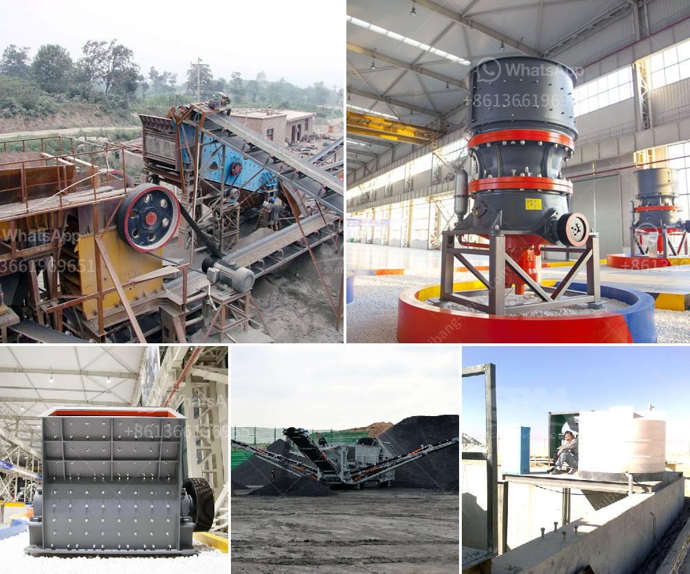

<h3>scrap prices per ton in south africa</h3>
Scrap metal has become an essential resource for various industries worldwide, providing a cost-effective and sustainable alternative to new raw materials. In South Africa, the scrap industry plays a vital role in the country's economy, contributing to job creation, resource conservation, and environmental sustainability. Understanding the scrap prices per ton in South Africa is crucial for buyers, sellers, and industry players. This article aims to shed light on the market trends and factors impacting scrap metal prices in the country.

Scrap metal is classified into ferrous and non-ferrous materials. Ferrous metals, such as iron and steel, are widely used in construction, automobiles, and machinery. Non-ferrous metals, including copper, aluminum, and brass, have extensive applications in electrical equipment, plumbing, and electronics. Both ferrous and non-ferrous metals have different market dynamics, influencing their respective prices.

The price of scrap metal per ton in South Africa is influenced by several factors, including global demand, market conditions, supply and demand imbalances, commodity price fluctuations, and government policies. Let's examine these factors in detail.

1. Global Demand: South Africa's scrap industry is not isolated but connected to the global market. The demand for scrap metal from overseas buyers, especially major consumers like China and India, significantly impacts local prices. Economic developments and industrial growth in these countries can create a surge in demand, resulting in higher prices.

2. Market Conditions: Local market conditions, such as the state of the economy, supply and demand dynamics, and competition among scrap dealers, play a role in determining scrap prices. When the economy is booming, there is usually increased demand for construction and infrastructure projects, leading to higher scrap prices. Conversely, during an economic downturn, prices may dip due to reduced demand.

3. Supply and Demand Imbalances: The availability and scarcity of scrap materials influence prices. If the supply of scrap metal is low and demand is high, prices tend to increase. Conversely, when supply outweighs demand, prices may decrease. Regional and global market conditions can contribute to imbalances and affect local prices.

4. Commodity Price Fluctuations: Scrap metal prices are tied to the prices of newly produced metal commodities, as they compete for similar end-users. A rise or fall in commodity prices, such as iron ore, copper, or aluminum, can affect scrap metal prices. This linkage reflects the underlying cost of primary metal production and its substitutes.

5. Government Policies: Government regulations, taxes, and incentives can influence scrap metal prices. Policies that promote recycling and sustainable practices may support higher prices, as scrap becomes a more sought-after resource. On the other hand, import/export duties and restrictions can impact the cost of scrap materials.

Scrap metal prices in South Africa vary based on the type, quality, and market demand. Currently, the average price for ferrous metals like iron and steel ranges from ZAR 1,800 to ZAR 3,500 per ton. Non-ferrous metals, such as copper and aluminum, carry higher price tags, with copper ranging from ZAR 22,000 to ZAR 26,000 per ton and aluminum from ZAR 12,000 to ZAR 14,000 per ton.

It is important to note that the aforementioned figures serve as a general guideline and may fluctuate. Buyers and sellers should stay updated with current market conditions and consult reputable sources like industry associations, scrap metal exchanges, and market reports to receive accurate and real-time prices.

In conclusion, understanding the scrap metal market in South Africa requires analyzing various factors that influence prices. It is a complex environment influenced by global demand, market conditions, supply and demand imbalances, commodity price fluctuations, and government policies. Monitoring these trends and staying informed will help industry players make informed decisions and benefit from the dynamic scrap metal market in South Africa.
<h3>Contact us</h3><ul><li><strong>Whatsapp:&nbsp;<a href="https://wa.me/8613661969651">+8613661969651</a></strong></li><li><a href="https://swt.shibang-china.com/?git&amp;zhl&amp;scrap prices per ton in south africa"><strong>Online Service(chat now)</strong></a></li></ul><h3>Related</h3><ul><li><a href='how much is crusher for gypsum.md'>how much is crusher for gypsum</a></li><li><a href='balls in cement grinding.md'>balls in cement grinding</a></li><li><a href='south africa used chrome ore mining crushing equipment.md'>south africa used chrome ore mining crushing equipment</a></li><li><a href='enquiry rock crusher.md'>enquiry rock crusher</a></li><li><a href='raymond grinding mill manufacturers in udaipur.md'>raymond grinding mill manufacturers in udaipur</a></li></ul>