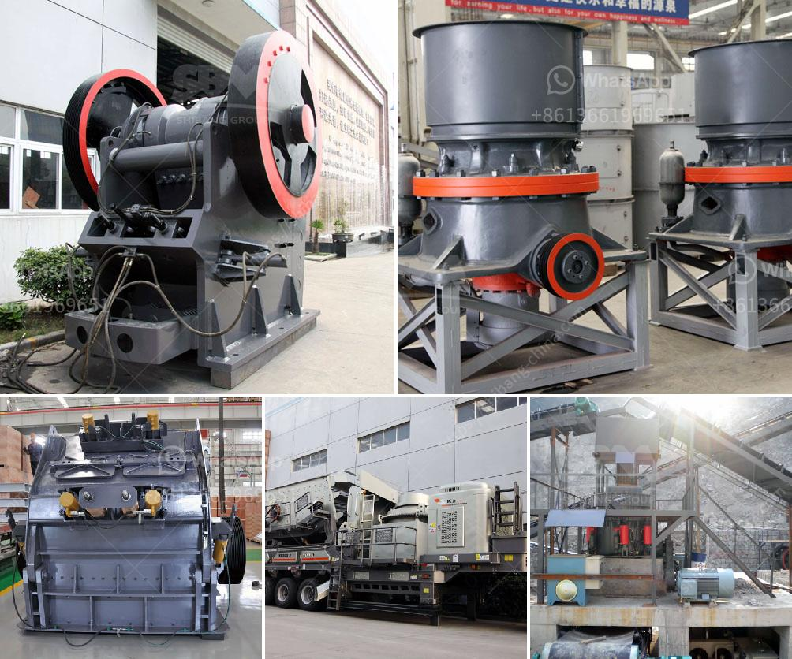

<h3>screening machine for sale south africa</h3>
In the dynamic world of mining, construction, and industrial processes, the need for efficient screening machines cannot be overstated. With South Africa being a key player in various industries, it is essential to have reliable equipment that can handle the demanding tasks of material separation. In this article, we will delve into the advantages of screening machines for sale in South Africa and why investing in these machines is a wise choice.

Screening machines serve as the backbone of effective material separation processes. By using a mesh or perforated plate, these machines efficiently classify and segregate different types of materials based on their size. With advanced technological features and innovative designs, modern screening machines offer enhanced efficiency and productivity compared to their traditional counterparts.

One significant advantage of investing in screening machines for sale in South Africa is the ability to achieve rapid and accurate screening. These machines are designed to handle large volumes of materials while maintaining precision in the separation process. By accurately sizing materials, the desired product can be efficiently isolated, saving time and resources.

Screening machines cater to a wide range of industries and applications. Whether in mining, construction, aggregate processing, or recycling industries, these versatile machines can efficiently handle various materials such as rock, sand, gravel, ores, and even waste products. The adaptability of screening machines makes them an invaluable asset for businesses in South Africa looking to streamline their processes and maximize productivity.

With the diverse nature of materials and operational needs, screening machines for sale in South Africa offer customizable options to meet specific requirements. These machines can be equipped with multiple layers of screens, adjustable tilt angles, and variable vibration frequencies to suit different material types and desired separation outcomes. Customization ensures that businesses can optimize the screening process and achieve the desired result efficiently.

Investing in screening machines for sale in South Africa ensures durability and longevity in performance. These machines are built from robust materials and designed with the rugged South African working conditions in mind. High-quality components and advanced engineering techniques ensure that the screening machines can withstand heavy-duty operations, requiring minimal maintenance and providing a longer operational lifespan.

The availability of screening machines for sale in South Africa presents an excellent economic opportunity for businesses. Investing in these machines allows companies to reduce reliance on outsourced separation services, enabling them to perform in-house screening operations and save on costs. By owning screening machines, businesses can have greater control over their production processes, resulting in improved profitability.

Screening machines for sale in South Africa offer numerous advantages for businesses operating in various industries. From enhanced efficiency and productivity to the ability to perform rapid and accurate screening, these machines are an essential asset for material separation processes. Moreover, the customizable options, combined with the durability and long lifespan, ensure that businesses can tailor the screening process to suit their specific requirements. With the economic viability they offer, screening machines are a smart investment for businesses aiming to optimize their operations and compete in the modern market.
<h3>Contact us</h3><ul><li><strong>Whatsapp:&nbsp;<a href="https://wa.me/8613661969651">+8613661969651</a></strong></li><li><a href="https://swt.shibang-china.com/?git&amp;zhl&amp;screening machine for sale south africa"><strong>Online Service(chat now)</strong></a></li></ul><h3>Related</h3><ul><li><a href='quarry crusher zimbabwe.md'>quarry crusher zimbabwe</a></li><li><a href='conveyor belt manufacturers in bangladesh.md'>conveyor belt manufacturers in bangladesh</a></li><li><a href='grinding ball mill machine manufacturer europe.md'>grinding ball mill machine manufacturer europe</a></li><li><a href='diamond screening equipment for sale.md'>diamond screening equipment for sale</a></li><li><a href='clay processing clay processing south africa.md'>clay processing clay processing south africa</a></li></ul>