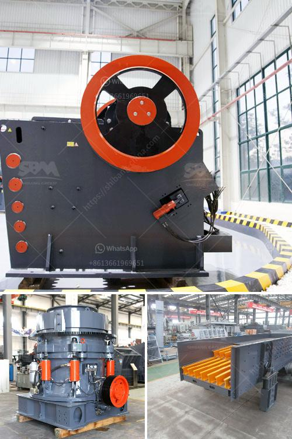

<h3>second hand coal mining crushers in zimbabwe</h3>
The mining industry is one of Zimbabwe's economic pillars, contributing about 16% of the country's GDP. It has also generated significant employment opportunities for Zimbabweans, with thousands of individuals directly and indirectly employed in the sector. Coal mining is one of the most vital aspects of the mining industry, contributing significantly to the nation's energy production.

As with any mining operation, crushers are essential for breaking down the extracted raw materials into smaller, more manageable sizes. The crushing process creates a significant amount of dust and fines, which need to be effectively managed to minimize environmental impact and health hazards for workers. In Zimbabwe, there is an increased demand for second-hand crushers in mines as well as in recycling projects.

Second-hand crushers offer cost savings compared to new ones, as they are priced at a fraction of the cost of new crushers. Yet, they still function effectively and efficiently, performing the same tasks as their newer counterparts. This cost advantage makes second-hand crushers an attractive option for businesses looking to expand their mining operations or for those seeking to enter the industry for the first time.

Furthermore, second-hand crushers often come with the added benefit of being fully refurbished and upgraded by professional technicians. This ensures that they are in excellent working condition and ready to perform heavy-duty tasks. The refurbishment process typically includes replacing worn-out parts, repairing any damaged components, and conducting comprehensive testing to guarantee their functionality.

The availability of second-hand crushers in Zimbabwe is also facilitated by the country's rich mining history. Many mining operations have closed or downsized in recent years due to various reasons, such as resource depletion or economic shifts. Consequently, the market is flooded with second-hand crushers, making them readily accessible for interested buyers.

Investing in second-hand crushers can yield significant returns on investment for mining companies. By acquiring these machines, businesses can increase their production capacity without incurring substantial costs. This, in turn, allows them to meet growing demand while remaining competitive in the market. Additionally, the cost savings from purchasing second-hand crushers can be allocated to other essential aspects of the mining operation, such as acquiring additional equipment or investing in research and development.

However, despite the advantages, there are also some considerations and precautions to be mindful of when purchasing second-hand crushers. Prospective buyers should thoroughly inspect the machines, ensuring that they meet quality standards and adhere to safety regulations. Engaging the services of experienced and reputable technical experts can help verify the reliability of the crushers and mitigate the risk of purchasing substandard or unsafe equipment.

In conclusion, second-hand coal mining crushers have become an attractive option in Zimbabwe due to their cost savings and functionality. The availability of refurbished machines in good working condition and the country's rich mining history contribute to the widespread availability of these crushers. When acquired wisely, second-hand crushers can significantly enhance the production capacity of mining operations while maximizing cost-efficiency. Careful inspection and verification are necessary to ensure the quality and safety of the equipment, ultimately contributing to the overall success of the mining sector in Zimbabwe.
<h3>Contact us</h3><ul><li><strong>Whatsapp:&nbsp;<a href="https://wa.me/8613661969651">+8613661969651</a></strong></li><li><a href="https://swt.shibang-china.com/?git&amp;zhl&amp;second hand coal mining crushers in zimbabwe"><strong>Online Service(chat now)</strong></a></li></ul><h3>Related</h3><ul><li><a href='vertical horizontal milling machine.md'>vertical horizontal milling machine</a></li><li><a href='stone crusher in the philippines for sale.md'>stone crusher in the philippines for sale</a></li><li><a href='ball mill ball portable.md'>ball mill ball portable</a></li><li><a href='stone crushing machine suppliers.md'>stone +crushing +machine +suppliers</a></li><li><a href='18 36 inch jaw crusher plant in south africa.md'>18 36 inch jaw crusher plant in south africa</a></li></ul>