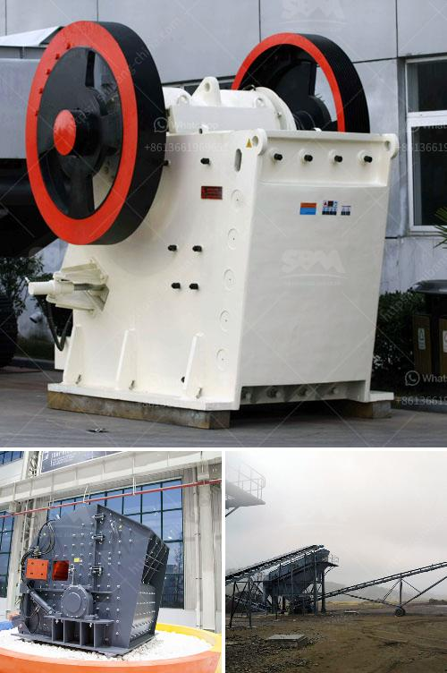

<h3>second hand equipment for sale in south africa</h3>
When it comes to purchasing equipment, the price tag can often be a significant deterrent. However, in South Africa, there is a viable and cost-effective solution - second-hand equipment. With a wide range of options available, from industrial machinery to household appliances, buying second-hand can save you a fortune while still meeting your needs.

One of the primary advantages of purchasing second-hand equipment in South Africa is the substantial price difference. You can typically find items at a fraction of the cost of new equipment, allowing you to stretch your budget further. This affordability is particularly beneficial for small businesses, startups, or individuals looking to replace broken items without breaking the bank.

In addition to financial savings, opting for second-hand equipment promotes sustainability and reduces waste. By choosing to give these items a second life, you are actively participating in recycling efforts and keeping functional equipment out of landfills. Furthermore, this revives the market for used goods, stimulating the economy and creating opportunities for sellers and buyers alike.

With the rise of online marketplaces and classified ads, finding second-hand equipment has never been easier in South Africa. From websites dedicated to selling used goods to local Facebook groups and community notice boards, you can connect with sellers directly and negotiate suitable deals. Moreover, these platforms often provide reviews and ratings, ensuring a more transparent and secure buying experience.

However, it is essential to proceed with caution when purchasing second-hand equipment. Always thoroughly inspect the item before finalizing the sale, ensuring it is in good working condition. If possible, request a demonstration or test it out yourself before making a decision. Additionally, consider the reputation of the seller, especially if buying from an individual. Trustworthy sellers will be happy to answer your questions and provide any necessary documentation.

Overall, purchasing second-hand equipment in South Africa offers a budget-friendly and environmentally conscious alternative. So, whether you are outfitting a business, upgrading your home, or searching for a new hobby, explore the world of second-hand equipment - it's a win-win for your wallet and the planet.
<h3>Contact us</h3><ul><li><strong>Whatsapp:&nbsp;<a href="https://wa.me/8613661969651">+8613661969651</a></strong></li><li><a href="https://swt.shibang-china.com/?git&amp;zhl&amp;second hand equipment for sale in south africa"><strong>Online Service(chat now)</strong></a></li></ul><h3>Related</h3><ul><li><a href='coal wash and crusher machine.md'>coal wash and crusher machine</a></li><li><a href='usina de minerio de ferro para venda no mexico.md'>usina de minerio de ferro para venda no mexico</a></li><li><a href='ball mill cement grinding.md'>ball mill cement grinding</a></li><li><a href='jaw crushers in south africa.md'>jaw crushers in south africa</a></li><li><a href='crushing plant for sale philippines.md'>crushing plant for sale philippines</a></li></ul>