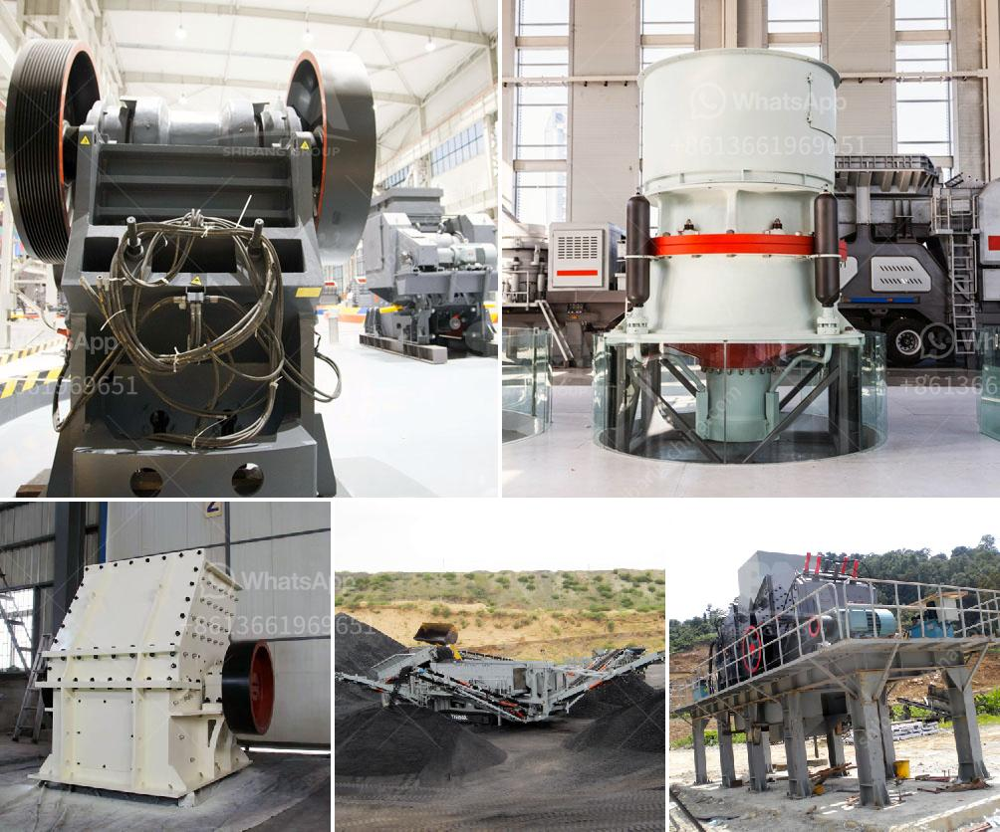

<h3>second hand jaw crusher philippines</h3>
When it comes to finding an efficient and reliable crusher for your construction project, choosing a second-hand jaw crusher may seem like a daunting task. As you browse through various second-hand options, you may be overwhelmed by the wide range of possibilities and the uncertainty of how well they will perform. However, with proper research and understanding of your specific needs, buying a second-hand jaw crusher in the Philippines can be a smart and economical solution.

One of the most important factors to consider when purchasing a used jaw crusher is the condition of the machine. It is crucial to conduct a thorough inspection of the machine before making a purchase to ensure that it is in good working condition and free from any potential issues. Look for signs of wear and tear, such as rust, cracks, or damaged parts. Additionally, make sure to check the engine and electrical systems to ensure they are functioning properly.

Another important aspect to consider is the crusher's capacity and efficiency. Different jaw crushers have varying sizes and capacities, so it is essential to choose a machine that can handle the requirements of your project. Consider the type of material you will be crushing and the desired output size. Additionally, take into account the operating costs and energy efficiency of the machine to make an informed decision.

Buying a second-hand jaw crusher in the Philippines can also be beneficial if you are on a tight budget. You will find that jaw crushers in this country are competitively priced compared to models sold in other parts of the world. This is due to lower labor and operating costs, as well as lower transportation costs, as the Philippines is strategically located in Southeast Asia.

Moreover, opting for a second-hand jaw crusher can help reduce the environmental impact of your project. By reusing a previously owned machine, you are contributing to the concept of sustainability and reducing waste. Many jaw crushers are built to last and can still provide high-quality performance even after being used for several years. With proper maintenance and regular servicing, a second-hand jaw crusher can serve your construction needs for years to come.

In conclusion, buying a second-hand jaw crusher in the Philippines can be a practical and cost-efficient solution for your construction project. It is essential to carefully assess the condition, capacity, and efficiency of the machine to ensure it meets your specific requirements. By purchasing a second-hand crusher, you can save money, reduce environmental impact, and still achieve high-quality crushing results.
<h3>Contact us</h3><ul><li><strong>Whatsapp:&nbsp;<a href="https://wa.me/8613661969651">+8613661969651</a></strong></li><li><a href="https://swt.shibang-china.com/?git&amp;zhl&amp;second hand jaw crusher philippines"><strong>Online Service(chat now)</strong></a></li></ul><h3>Related</h3><ul><li><a href='gold processing per hour.md'>gold processing per hour</a></li><li><a href='coal machinery for coal processing crusher.md'>coal machinery for coal processing crusher</a></li><li><a href='crusher chromite sand buyers china.md'>crusher chromite sand buyers china</a></li><li><a href='carbonate from barite manufacturing process.md'>carbonate from barite manufacturing process</a></li><li><a href='granite machine manufacturer india.md'>granite machine manufacturer india</a></li></ul>