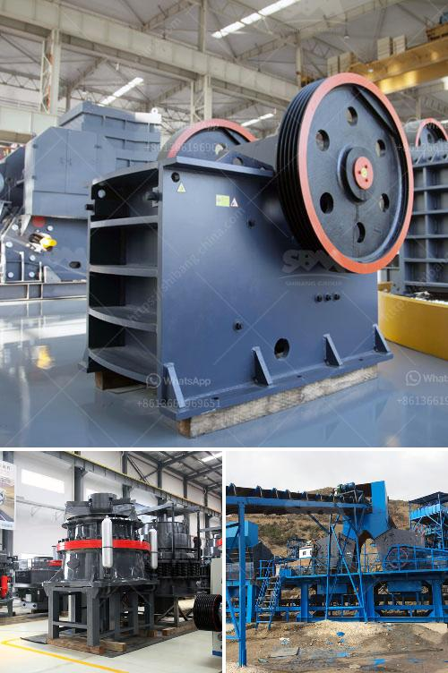

<h3>second hand mobile coal washing plant</h3>
The coal mining industry has been facing some significant challenges in recent times. With rising environmental concerns and stricter regulations, coal mining companies are under increasing pressure to improve their operational efficiency and reduce the negative impact of their activities on the environment. One area where significant improvements can be made is in the coal washing process.

Coal washing is a process that is used to remove impurities from coal before it can be used as fuel. The process involves crushing and screening the coal to separate it into different size fractions, followed by dense medium separation to separate the valuable coal from the waste material. However, the capital investment required for setting up a coal washing plant is often a major deterrent for many coal mining companies.

Fortunately, there is an affordable solution available in the form of second-hand mobile coal washing plants. These plants are fully functional and operational units that have been previously used by other coal mining companies. They provide an opportunity for coal mining companies to acquire a fully functional plant at a fraction of the cost of a new plant.

The advantages of second-hand mobile coal washing plants are numerous. Firstly, the cost savings are significant. Buying a second-hand plant allows coal mining companies to avoid the high capital investment that is required for a new plant. This is particularly beneficial for smaller mining companies with limited financial resources. The cost savings can then be invested in other areas of the business to further improve operational efficiency.

Secondly, the use of a second-hand mobile coal washing plant allows for flexibility in operations. These plants are mobile and can be easily transported to different sites as required. This provides mining companies with the flexibility to move the plant closer to the mines, reducing transportation costs and improving overall operational efficiency. Additionally, mobile plants can be easily relocated or sold when they are no longer needed, further reducing costs and improving the return on investment.

Thirdly, the use of second-hand mobile coal washing plants is an environmentally friendly solution. By reusing existing plants, mining companies can avoid the need for new construction, which often leads to the destruction of natural habitats and the release of greenhouse gases. Furthermore, coal washing plants help reduce the amount of waste material generated by the mining process, as the impurities are separated and discarded. This contributes to a cleaner and greener mining industry.

In conclusion, second-hand mobile coal washing plants offer an affordable and sustainable solution for the coal mining industry. With their cost savings, operational flexibility, and environmental benefits, these plants provide an opportunity for mining companies to improve their operational efficiency and reduce their environmental impact. By investing in second-hand plants, coal mining companies can make significant progress towards a more sustainable future.
<h3>Contact us</h3><ul><li><strong>Whatsapp:&nbsp;<a href="https://wa.me/8613661969651">+8613661969651</a></strong></li><li><a href="https://swt.shibang-china.com/?git&amp;zhl&amp;second hand mobile coal washing plant"><strong>Online Service(chat now)</strong></a></li></ul><h3>Related</h3><ul><li><a href='ball mill suppliers in hyderabad.md'>ball mill suppliers in hyderabad</a></li><li><a href='stone principle crusher project.md'>stone principle crusher project</a></li><li><a href='2 roll mill machine.md'>2 roll mill machine</a></li><li><a href='silica quartz grinding plants bangalore.md'>silica quartz grinding plants bangalore</a></li><li><a href='quarry crusher for sales in germany.md'>quarry crusher for sales in germany</a></li></ul>