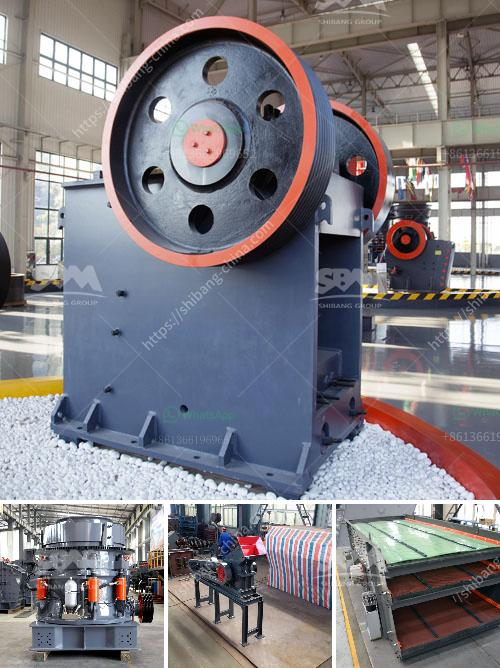

<h3>sell artificial sand mill</h3>
Artificial sand mills have become essential machinery in the construction industry as they are responsible for producing high-quality sand, acting as a substitute for natural sand. With the increasing demand for sand in various construction projects, the market for artificial sand mills is growing rapidly.

One of the main advantages of using artificial sand mills is that they can produce sand of desired specifications by controlling the particle size and shape. This ensures that the final product meets the quality requirements set by the construction industry.

These mills are designed to efficiently grind, crush, and shape raw materials, such as rocks, into sand particles. They utilize advanced technology and precision engineering to ensure efficient operation and optimum performance. With adjustable settings, operators can easily control the size and shape of the sand produced, allowing for customization based on the specific project requirements.

Artificial sand mills are also known for their durability and low maintenance requirements. They are built to withstand harsh working conditions and are designed to operate continuously without any major breakdowns. This not only saves time and costs on repairs and replacements but also ensures uninterrupted production, meeting tight project deadlines.

In addition to construction projects, artificial sand mills also find applications in various industries like mining, cement, and chemicals. They are used to produce sand for concrete, mortar, plastering, and other applications. The versatility and efficiency of these mills make them a valuable asset across different sectors.

When considering purchasing an artificial sand mill, it is important to choose a reliable manufacturer or supplier who offers quality equipment and after-sales support. They should provide comprehensive technical assistance, ensuring that the mill is installed and operated correctly. Additionally, it is important to consider factors such as capacity, power consumption, and maintenance requirements to find the most suitable mill for one's specific needs.

As the demand for sand continues to grow, artificial sand mills are becoming indispensable in the construction industry. Their ability to produce high-quality sand, along with their durability and efficiency, make them a valuable investment for any construction or industrial project.
<h3>Contact us</h3><ul><li><strong>Whatsapp:&nbsp;<a href="https://wa.me/8613661969651">+8613661969651</a></strong></li><li><a href="https://swt.shibang-china.com/?git&amp;zhl&amp;sell artificial sand mill"><strong>Online Service(chat now)</strong></a></li></ul><h3>Related</h3><ul><li><a href='gypsum board manufacturing plant.md'>gypsum board manufacturing plant</a></li><li><a href='used rock crushing plant for sale in uae.md'>used rock crushing plant for sale in uae</a></li><li><a href='grinding ball mill machine manufacturer europe.md'>grinding ball mill machine manufacturer europe</a></li><li><a href='jual jaw crusher bekas surabaya.md'>jual jaw crusher bekas surabaya</a></li><li><a href='ball mill for grinding of soda feldspar.md'>ball mill for grinding of soda feldspar</a></li></ul>