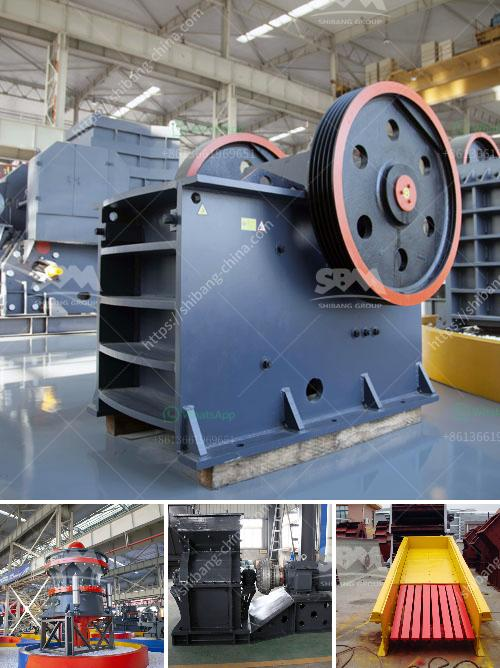

<h3>sell jaw crusher jaw pe 250x400 tph</h3>
Are you in the mining industry and looking to add a jaw crusher to your equipment lineup? If so, you've come to the right place. In this article, we will be discussing the benefits of selling jaw crushers, specifically the PE 250x400 model, with a capacity of tph.

A jaw crusher is a machine that breaks down materials into smaller pieces using two jaw-shaped components. These components move in a reciprocating motion, applying force on the material and breaking it down. Jaw crushers are widely used in the mining industry due to their ability to crush tough materials, making them suitable for primary crushing.

Now let's talk about the PE 250x400 model. This jaw crusher is equipped with a 15 kW motor and has a maximum feed size of 210 mm. It can crush materials ranging from limestone to granite, making it versatile and suitable for various applications. With a capacity of tph, it can handle large quantities of material efficiently, saving you time and increasing productivity.

One of the key advantages of selling the PE 250x400 jaw crusher is its durability. The machine is designed with high-quality materials, ensuring it can withstand the harsh conditions of a mining site. Its sturdy construction minimizes wear and tear, reducing the need for frequent maintenance and repairs. This, in turn, lowers operational costs and increases profitability.

In addition to its durability, the PE 250x400 jaw crusher offers exceptional performance. Its powerful motor enables it to crush even the hardest materials with ease. The adjustable setting allows you to control the size of the final product, ensuring it meets specific requirements. Whether you need coarse or fine crushing, this jaw crusher can deliver outstanding results.

Furthermore, the PE 250x400 jaw crusher is compact and easy to transport. Its compact size makes it suitable for both fixed and mobile installations. Whether you are working on-site or need to move the machine to different locations, its portability is a great advantage. This means you can bring the jaw crusher to the materials, minimizing transportation costs.

To sum it up, selling the PE 250x400 jaw crusher is a smart business move for anyone in the mining industry. Its durability, exceptional performance, and versatility make it a valuable asset. By investing in this machine, you can increase productivity, reduce operational costs, and ultimately, drive profitability.

In conclusion, if you are looking to add a jaw crusher to your equipment lineup, consider the PE 250x400 model. With a capacity of tph, it can handle tough materials efficiently. Its durability, exceptional performance, and portability make it a valuable asset in the mining industry. Don't miss the opportunity to boost your productivity and profitability. Invest in a PE 250x400 jaw crusher today!
<h3>Contact us</h3><ul><li><strong>Whatsapp:&nbsp;<a href="https://wa.me/8613661969651">+8613661969651</a></strong></li><li><a href="https://swt.shibang-china.com/?git&amp;zhl&amp;sell jaw crusher jaw pe 250x400 tph"><strong>Online Service(chat now)</strong></a></li></ul><h3>Related</h3><ul><li><a href='silica quartz grinding plants bangalore.md'>silica quartz grinding plants bangalore</a></li><li><a href='brick factory for sale in uk.md'>brick factory for sale in uk</a></li><li><a href='ball mill manufacturer in sri lanka.md'>ball mill manufacturer in sri lanka</a></li><li><a href='component and processes of cement.md'>component and processes of cement</a></li><li><a href='hammer crushers price.md'>hammer crushers price</a></li></ul>